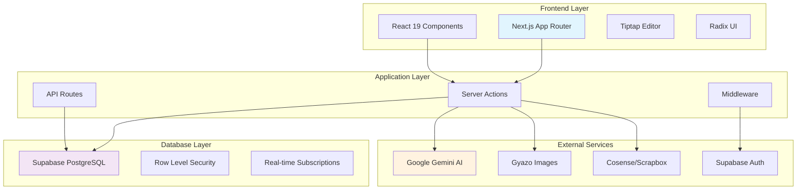

# for-all-learners リバースエンジニアリング設計書

## 概要

このディレクトリには、`for-all-learners` プロジェクトのコードベースから逆生成された包括的な技術設計文書が格納されています。

**分析実行日**: 2025-07-31 JST  
**対象コードベース**: Next.js 15 + React 19 + TypeScript + Supabase  
**分析範囲**: 全ソースコード（127の実装済みタスクを特定）

## 文書構成

### 📋 [discovered-tasks.md](./for-all-learners-discovered-tasks.md)
**逆算タスク一覧** - 実装されている機能から逆算したタスク構造
- 発見タスク数: 127個
- 推定総工数: 1,200時間
- 実装完了率: 約95%
- 技術負債・改善提案を含む

### 🏗️ [architecture.md](./for-all-learners-architecture.md)
**アーキテクチャ設計** - システム全体の技術構成と設計パターン
- Next.js App Router + Server Actions アーキテクチャ
- 技術スタック詳細分析
- デザインパターンの特定
- 非機能要件の実装状況

### 🔄 [dataflow.md](./for-all-learners-dataflow.md)
**データフロー図** - システム内のデータの流れと状態管理
- 認証フロー（Google OAuth, Magic Link）
- Server Actions によるデータ操作フロー
- React Query + Jotai 状態管理
- AI統合・外部サービス連携フロー

### 🔌 [api-specs.md](./for-all-learners-api-specs.md)
**API仕様書** - Server Actions と REST API の詳細仕様
- 50+ Server Actions の詳細定義
- REST API エンドポイント仕様
- 認証・認可システム詳細
- エラーハンドリング仕様

### 🗄️ [database.md](./for-all-learners-database.md)
**データベース設計** - PostgreSQL スキーマとRLS設計
- 35+ テーブルの詳細定義
- ER図とリレーションシップ
- Row Level Security (RLS) ポリシー
- パフォーマンス最適化（インデックス戦略）

### 🎨 [components.md](./for-all-learners-components.md)
**コンポーネント設計** - React コンポーネントアーキテクチャ
- 40+ Radix UI ベースコンポーネント
- 機能別コンポーネント設計
- カスタムフック実装パターン
- アクセシビリティ対応

### 🔧 [interfaces.ts](./for-all-learners-interfaces.ts)
**TypeScript型定義集約** - システム全体の型定義
- データベース型定義
- API型定義
- コンポーネントProps型
- ユーティリティ型

## 主要な発見事項

### 技術的優位性

1. **現代的な技術スタック**
   - Next.js 15 + React 19 + TypeScript
   - Server Actions による型安全なサーバー連携
   - Supabase による包括的なBaaS活用

2. **優れたアーキテクチャ設計**
   - Row Level Security による堅牢なセキュリティ
   - React Query による最適化された状態管理
   - Tiptap による高機能リッチテキストエディタ

3. **包括的な機能実装**
   - フラッシュカード学習システム
   - ノート・ページ管理システム
   - AI統合（Google Gemini）
   - 外部サービス統合（Cosense, Gyazo）

4. **商用レベルの品質**
   - 管理者機能・分析機能
   - マーケティングページ完備
   - 多言語・多テーマ対応

### 技術的負債・改善項目

1. **テスト基盤**
   - 単体テスト未実装
   - 統合テスト未実装
   - E2Eテスト未実装

2. **監視・運用**
   - エラートラッキング（Sentry等）未導入
   - パフォーマンス監視（APM）未導入
   - ログ集約システム未実装

3. **セキュリティ強化**
   - セキュリティヘッダー設定
   - レート制限実装
   - CSPポリシー設定

4. **ドキュメント**
   - API仕様書（OpenAPI）
   - 運用手順書
   - 開発者ガイド

## システム概要図



## 利用方法

### 開発者向け
- 新機能開発時の設計参考資料
- システム理解のためのドキュメント
- アーキテクチャレビューの基準資料

### プロジェクトマネージャー向け
- 技術的負債の把握
- 今後の開発計画策定
- リソース配分の判断材料

### 品質保証向け
- テスト設計の参考資料
- セキュリティ監査のベースライン
- パフォーマンステスト観点の抽出

## 推奨活用順序

1. **システム概要理解**: `architecture.md` → `discovered-tasks.md`
2. **詳細実装理解**: `database.md` → `api-specs.md` → `components.md`
3. **データフロー理解**: `dataflow.md`
4. **型定義参照**: `interfaces.ts`

## 更新・保守

この設計書は実装から逆生成された静的文書です。コードベースの変更に応じて定期的な更新が推奨されます。

### 更新推奨タイミング
- 主要機能追加時
- アーキテクチャ変更時
- 外部サービス統合時
- 四半期レビュー時

### 更新方法
```bash
# rev-tasks コマンドで再分析
claude code rev-tasks

# rev-design コマンドで設計書再生成
claude code rev-design
```

## 関連リソース

- [プロジェクトREADME](../../README.md)
- [開発ガイド](../../CLAUDE.md)
- [ワークログ](../work-logs/)
- [要件定義](../requirements/)

---

**注意**: この文書は2025-07-31時点のコードベース分析結果です。最新の実装状況については実際のソースコードを確認してください。