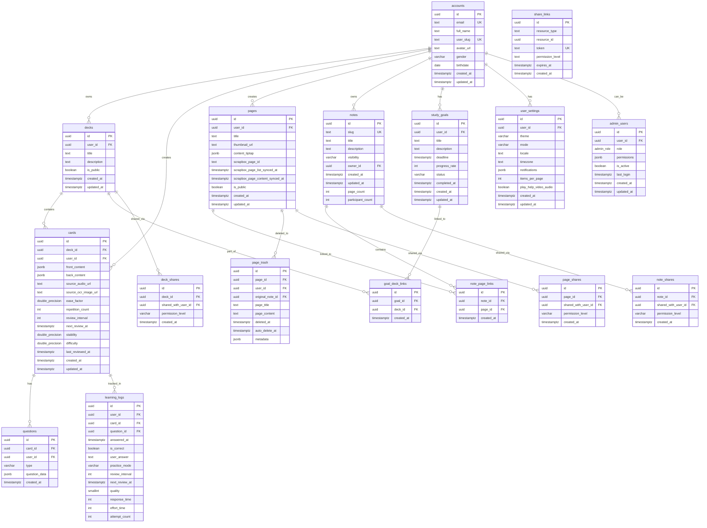

# for-all-learners データベース設計（逆生成）

## 分析日時
2025-07-31 JST

## データベース概要

### DBMS情報
- **DBMS**: PostgreSQL (Supabase)
- **バージョン**: PostgreSQL 15+
- **文字セット**: UTF-8
- **タイムゾーン**: UTC
- **拡張機能**: pgcrypto, uuid-ossp, fuzzystrmatch

### アーキテクチャ特徴
- **Row Level Security (RLS)**: 全テーブルで行レベルセキュリティ有効
- **自動生成UUID**: 主キーにgen_random_uuid()使用
- **自動タイムスタンプ**: created_at, updated_at の自動更新
- **JSONB活用**: リッチコンテンツをJSONB型で格納
- **全文検索**: PostgreSQL組み込み全文検索機能活用

## スキーマ概要

### テーブル分類
- **ユーザー管理**: accounts, user_settings, admin_users
- **学習コンテンツ**: decks, cards, questions, pages
- **ノート・協業**: notes, note_shares, note_page_links
- **学習進捗**: learning_logs, deck_study_logs, study_goals
- **共有・権限**: deck_shares, page_shares, share_links
- **外部統合**: cosense_projects, gyazo_albums, quizlet_sets
- **システム**: action_logs, inquiries, changelog_entries
- **トラッシュ**: page_trash

### 主要リレーション数
- **総テーブル数**: 35+
- **外部キー制約**: 60+
- **インデックス数**: 40+
- **RPC関数**: 5+

## ER図



## テーブル詳細定義

### ユーザー管理

#### accounts テーブル
```sql
CREATE TABLE accounts (
    id UUID REFERENCES auth.users NOT NULL PRIMARY KEY,
    email TEXT UNIQUE,
    full_name TEXT,
    user_slug TEXT UNIQUE,
    avatar_url TEXT,
    gender VARCHAR(10) CHECK (gender IN ('male','female','other','prefer_not_to_say')),
    birthdate DATE,
    created_at TIMESTAMP WITH TIME ZONE DEFAULT NOW(),
    updated_at TIMESTAMP WITH TIME ZONE DEFAULT NOW()
);
```

**カラム説明**:
- `id`: Supabase Auth users テーブルとの外部キー
- `email`: メールアドレス（一意制約）
- `user_slug`: ユーザー識別用スラッグ（URL用）
- `gender`: 性別（4つの選択肢）

**制約・インデックス**:
- `UNIQUE(email)`, `UNIQUE(user_slug)`

#### user_settings テーブル
```sql
CREATE TABLE user_settings (
    id UUID PRIMARY KEY DEFAULT gen_random_uuid(),
    user_id UUID NOT NULL REFERENCES accounts(id),
    theme VARCHAR(50) NOT NULL DEFAULT 'ocean',
    mode VARCHAR(10) NOT NULL DEFAULT 'light' CHECK (mode IN ('light','dark')),
    locale TEXT NOT NULL DEFAULT 'en',
    timezone TEXT NOT NULL DEFAULT 'UTC',
    notifications JSONB NOT NULL DEFAULT '{}'::jsonb,
    items_per_page INTEGER NOT NULL DEFAULT 20,
    play_help_video_audio BOOLEAN NOT NULL DEFAULT FALSE,
    cosense_sync_enabled BOOLEAN NOT NULL DEFAULT FALSE,
    notion_sync_enabled BOOLEAN NOT NULL DEFAULT FALSE,
    gyazo_sync_enabled BOOLEAN NOT NULL DEFAULT FALSE,
    quizlet_sync_enabled BOOLEAN NOT NULL DEFAULT FALSE,
    created_at TIMESTAMPTZ NOT NULL DEFAULT NOW(),
    updated_at TIMESTAMPTZ NOT NULL DEFAULT NOW()
);
```

**特徴**:
- 7種類のテーマ対応
- 外部サービス統合フラグ
- 通知設定をJSONB形式で格納

### フラッシュカード

#### cards テーブル
```sql
CREATE TABLE public.cards (
    id uuid NOT NULL DEFAULT gen_random_uuid(),
    deck_id uuid NOT NULL REFERENCES decks(id),
    user_id uuid NOT NULL REFERENCES accounts(id),
    front_content jsonb NOT NULL DEFAULT '{"type": "doc", "content": []}'::jsonb,
    back_content jsonb NOT NULL DEFAULT '{"type": "doc", "content": []}'::jsonb,
    source_audio_url text NULL,
    source_ocr_image_url text NULL,
    created_at timestamp with time zone NULL DEFAULT now(),
    updated_at timestamp with time zone NULL DEFAULT now(),
    -- FSRS Algorithm fields
    ease_factor double precision NOT NULL DEFAULT 2.5,
    repetition_count integer NOT NULL DEFAULT 0,
    review_interval integer NOT NULL DEFAULT 0,
    next_review_at timestamp with time zone NULL,
    stability double precision NOT NULL DEFAULT 0.0,
    difficulty double precision NOT NULL DEFAULT 1.0,
    last_reviewed_at timestamp with time zone NULL,
    CONSTRAINT cards_pkey PRIMARY KEY (id)
);
```

**特徴**:
- `front_content`, `back_content`: Tiptap JSONエディタ形式
- FSRS (Free Spaced Repetition Scheduler) アルゴリズム対応
- 音声・OCR生成元URL記録
- GINインデックスによる全文検索対応

**インデックス**:
```sql
CREATE INDEX idx_cards_front_content_gin ON cards USING gin (front_content jsonb_path_ops);
CREATE INDEX idx_cards_back_content_gin ON cards USING gin (back_content jsonb_path_ops);
```

### ノート・ページ管理

#### pages テーブル
```sql
CREATE TABLE pages (
    id UUID DEFAULT gen_random_uuid() PRIMARY KEY,
    user_id UUID REFERENCES accounts(id) NOT NULL,
    title TEXT NOT NULL,
    thumbnail_url TEXT,
    content_tiptap JSONB NOT NULL,
    scrapbox_page_id TEXT,
    scrapbox_page_list_synced_at TIMESTAMPTZ,
    scrapbox_page_content_synced_at TIMESTAMPTZ,
    is_public BOOLEAN DEFAULT FALSE,
    created_at TIMESTAMP WITH TIME ZONE DEFAULT NOW(),
    updated_at TIMESTAMP WITH TIME ZONE DEFAULT NOW()
);

-- Cosense同期用ユニーク制約
ALTER TABLE pages
ADD CONSTRAINT pages_user_scrapbox_unique UNIQUE (user_id, scrapbox_page_id);
```

**特徴**:
- Tiptap JSONエディタ形式でリッチコンテンツ保存
- Cosense (Scrapbox) 同期機能
- 自動更新トリガー実装

**自動更新トリガー**:
```sql
CREATE OR REPLACE FUNCTION auto_update_timestamp()
RETURNS TRIGGER AS $$
BEGIN
    IF TG_OP = 'UPDATE' THEN
        NEW.updated_at = NOW();
    END IF;
    RETURN NEW;
END;
$$ LANGUAGE plpgsql;

CREATE TRIGGER trg_pages_updated_at
BEFORE UPDATE ON pages
FOR EACH ROW
EXECUTE FUNCTION auto_update_timestamp();
```

#### notes テーブル（ノートグルーピング）
```sql
CREATE TABLE notes (
    id UUID DEFAULT gen_random_uuid() PRIMARY KEY,
    slug TEXT UNIQUE NOT NULL,
    title TEXT NOT NULL,
    description TEXT,
    visibility VARCHAR(20) NOT NULL DEFAULT 'private',
    owner_id UUID REFERENCES accounts(id) NOT NULL,
    created_at TIMESTAMPTZ DEFAULT NOW(),
    updated_at TIMESTAMPTZ DEFAULT NOW(),
    page_count INTEGER NOT NULL DEFAULT 0,
    participant_count INTEGER NOT NULL DEFAULT 0
);
```

**特徴**:
- スラッグベースのURL生成
- ページ数・参加者数の非正規化（パフォーマンス最適化）
- 可視性制御（private/public）

### ゴミ箱機能

#### page_trash テーブル
```sql
CREATE TABLE page_trash (
    id UUID PRIMARY KEY DEFAULT gen_random_uuid(),
    page_id UUID NOT NULL REFERENCES pages(id) ON DELETE CASCADE,
    user_id UUID NOT NULL REFERENCES accounts(id) ON DELETE CASCADE,
    original_note_id UUID REFERENCES notes(id) ON DELETE SET NULL,
    page_title TEXT NOT NULL,
    page_content TEXT,
    deleted_at TIMESTAMP WITH TIME ZONE DEFAULT NOW(),
    auto_delete_at TIMESTAMP WITH TIME ZONE DEFAULT (NOW() + INTERVAL '30 days'),
    metadata JSONB DEFAULT '{}'::jsonb
);
```

**特徴**:
- 30日間の自動削除設定
- 元の所属ノート情報保持
- メタデータをJSONBで柔軟に格納

**インデックス**:
```sql
CREATE INDEX idx_page_trash_user_deleted ON page_trash(user_id, deleted_at DESC);
CREATE INDEX idx_page_trash_auto_delete ON page_trash(auto_delete_at) WHERE auto_delete_at IS NOT NULL;
```

### 学習進捗管理

#### learning_logs テーブル
```sql
CREATE TABLE learning_logs (
    id UUID DEFAULT gen_random_uuid() PRIMARY KEY,
    user_id UUID REFERENCES accounts(id) NOT NULL,
    card_id UUID REFERENCES cards(id) NOT NULL,
    question_id UUID REFERENCES questions(id),
    answered_at TIMESTAMP WITH TIME ZONE DEFAULT NOW(),
    is_correct BOOLEAN NOT NULL,
    user_answer TEXT,
    practice_mode VARCHAR(20) NOT NULL,
    review_interval INTEGER,
    next_review_at TIMESTAMP WITH TIME ZONE,
    quality smallint NOT NULL DEFAULT 0,
    response_time integer NOT NULL DEFAULT 0,
    effort_time integer NOT NULL DEFAULT 0,
    attempt_count integer NOT NULL DEFAULT 1
);
```

**特徴**:
- 詳細な学習メトリクス記録
- 間隔反復学習アルゴリズム対応
- 練習モード別の記録

### 共有・協業機能

#### share_links テーブル（一時共有リンク）
```sql
CREATE TABLE share_links (
    id UUID DEFAULT gen_random_uuid() PRIMARY KEY,
    resource_type TEXT NOT NULL CHECK (resource_type IN ('deck','page','note')),
    resource_id UUID NOT NULL,
    token TEXT UNIQUE NOT NULL,
    permission_level TEXT NOT NULL CHECK (permission_level IN ('owner','editor','viewer')),
    created_at TIMESTAMP WITH TIME ZONE DEFAULT NOW(),
    expires_at TIMESTAMP WITH TIME ZONE
);
```

**特徴**:
- 複数リソースタイプ対応
- 権限レベル制御
- 期限付きリンク

### 外部サービス統合

#### cosense_projects テーブル（Scrapbox統合）
```sql
CREATE TABLE cosense_projects (
    id UUID DEFAULT gen_random_uuid() PRIMARY KEY,
    project_name TEXT NOT NULL UNIQUE,
    created_at TIMESTAMPTZ DEFAULT NOW(),
    updated_at TIMESTAMPTZ DEFAULT NOW()
);

CREATE TABLE user_cosense_projects (
    id UUID DEFAULT gen_random_uuid() PRIMARY KEY,
    user_id UUID NOT NULL REFERENCES accounts(id) ON DELETE CASCADE,
    cosense_project_id UUID NOT NULL REFERENCES cosense_projects(id) ON DELETE CASCADE,
    page_count INTEGER NOT NULL DEFAULT 0,
    accessible BOOLEAN NOT NULL DEFAULT TRUE,
    scrapbox_session_cookie TEXT,
    created_at TIMESTAMPTZ DEFAULT NOW(),
    updated_at TIMESTAMPTZ DEFAULT NOW(),
    UNIQUE(user_id, cosense_project_id)
);
```

**特徴**:
- プロジェクト別アクセス管理
- セッションクッキー保存（暗号化推奨）
- ページ数キャッシュ

## RPC関数（ストアドプロシージャ）

### search_suggestions 関数
```sql
CREATE FUNCTION public.search_suggestions(p_query text)
RETURNS TABLE (
    type       text,
    id         uuid,
    suggestion text,
    excerpt    text
)
LANGUAGE sql STABLE AS $$
-- カードとページの全文検索を統合実行
-- ts_headline でハイライト付き結果を返却
$$;
```

### get_note_pages 関数
```sql
-- ノートに属するページをページネーション付きで取得
-- パラメータ: p_note_id, p_limit, p_offset, p_sort
```

### get_pages_by_ids 関数
```sql
CREATE OR REPLACE FUNCTION get_pages_by_ids(
    ids TEXT[],
    uid UUID
)
RETURNS TABLE(
    scrapbox_page_id TEXT,
    updated_at TIMESTAMPTZ
) AS $$
-- Cosense同期用：複数ページの更新日時を一括取得
$$;
```

## Row Level Security (RLS) ポリシー

### 基本ポリシーパターン

#### 所有者アクセスポリシー
```sql
-- 例: cards テーブル
CREATE POLICY "Users can manage own cards" ON cards
FOR ALL
USING (user_id = auth.uid())
WITH CHECK (user_id = auth.uid());
```

#### 管理者アクセスポリシー
```sql
-- 例: accounts テーブル
CREATE POLICY "Admins can select accounts"
ON accounts FOR SELECT USING (public.is_admin_user());
```

#### 共有アクセスポリシー
```sql
-- 例: pages テーブル（公開ページ + 所有者）
CREATE POLICY "Anyone can view public pages" ON pages
FOR SELECT
USING (is_public = true OR user_id = auth.uid());
```

### 管理者判定関数
```sql
CREATE OR REPLACE FUNCTION public.is_admin_user()
RETURNS BOOLEAN AS $$
BEGIN
    RETURN EXISTS (
        SELECT 1 FROM admin_users 
        WHERE user_id = auth.uid() 
        AND is_active = true
    );
END;
$$ LANGUAGE plpgsql SECURITY DEFINER;
```

## パフォーマンス最適化

### 主要インデックス

#### 検索・絞り込み用
```sql
-- ユーザー別データ高速アクセス
CREATE INDEX idx_cards_user ON cards(user_id);
CREATE INDEX idx_pages_user ON pages(user_id);
CREATE INDEX idx_decks_user ON decks(user_id);

-- 学習進捗関連
CREATE INDEX idx_learning_logs_user ON learning_logs(user_id);
CREATE INDEX idx_learning_logs_card ON learning_logs(card_id);

-- 日時ソート用
CREATE INDEX idx_pages_updated ON pages(updated_at DESC);
CREATE INDEX idx_cards_next_review ON cards(next_review_at) WHERE next_review_at IS NOT NULL;
```

#### 全文検索用GINインデックス
```sql
CREATE INDEX idx_cards_front_content_gin ON cards USING gin (front_content jsonb_path_ops);
CREATE INDEX idx_cards_back_content_gin ON cards USING gin (back_content jsonb_path_ops);
```

#### 外部キー高速JOIN用
```sql
CREATE INDEX idx_note_page_links_note ON note_page_links(note_id);
CREATE INDEX idx_note_page_links_page ON note_page_links(page_id);
```

### クエリ最適化例

#### よく使用されるクエリパターン

1. **ユーザーのデッキ一覧（カード数付き）**
```sql
SELECT d.*, COUNT(c.id) as card_count
FROM decks d
LEFT JOIN cards c ON d.id = c.deck_id
WHERE d.user_id = $1
GROUP BY d.id
ORDER BY d.updated_at DESC;
```

2. **復習対象カード取得**
```sql
SELECT * FROM cards 
WHERE deck_id = $1 
AND (next_review_at IS NULL OR next_review_at <= NOW())
ORDER BY next_review_at ASC NULLS FIRST
LIMIT $2;
```

3. **ノートのページ一覧（ページネーション）**
```sql
-- RPC関数 get_note_pages で実装
SELECT p.*, COUNT(*) OVER() as total_count
FROM pages p
JOIN note_page_links npl ON p.id = npl.page_id
WHERE npl.note_id = $1
ORDER BY p.updated_at DESC
LIMIT $2 OFFSET $3;
```

## セキュリティ考慮事項

### データ暗号化
```sql
-- LLM APIキー暗号化用関数
CREATE OR REPLACE FUNCTION encrypt_user_llm_api_key(
    data TEXT,
    key TEXT
)
RETURNS TEXT LANGUAGE SQL STABLE AS $$
    SELECT ENCODE(pgp_sym_encrypt(data, key), 'base64');
$$;
```

### 入力検証
- CHECK制約による値範囲制限
- UNIQUE制約による重複防止
- NOT NULL制約によるデータ整合性確保
- 外部キー制約による参照整合性

### アクセス制御
- 全テーブルでRLS有効化
- ユーザー別データ分離
- 管理者権限の適切な分離
- 共有機能での権限レベル制御

## バックアップ・災害復旧

### Supabase標準機能
- **自動バックアップ**: 日次バックアップ
- **ポイントインタイムリカバリ**: 過去7日間
- **Multi-AZ配置**: 高可用性構成
- **レプリケーション**: 読み取りレプリカ

### 推奨追加対策
- **定期的なダンプ取得**: pg_dump による論理バックアップ
- **重要データの別途保管**: 暗号化済みAPIキー等
- **復旧手順書の整備**: 運用ドキュメント

## 拡張・改善提案

### 短期改善
1. **パフォーマンス監視**: pg_stat_statements有効化
2. **クエリ最適化**: 遅いクエリの特定・改善
3. **インデックス見直し**: 実際のクエリパターンに基づく最適化

### 中長期改善
1. **パーティショニング**: 大量データ対応（learning_logs等）
2. **読み取りレプリカ活用**: 検索・分析クエリの分離
3. **データアーカイブ**: 古いデータの別途保管

## まとめ

このデータベース設計は以下の特徴を持つ優れたスキーマです：

### 長所
1. **包括的な機能カバー**: 学習アプリケーションに必要な全機能を網羅
2. **優れたセキュリティ**: RLSによる行レベルセキュリティ
3. **パフォーマンス配慮**: 適切なインデックス設計
4. **拡張性**: JSONB活用による柔軟なデータ構造
5. **整合性**: 外部キー制約による堅牢な関係性

### 改善の余地
1. **パーティショニング**: 大量データ対応
2. **監視強化**: クエリパフォーマンス監視
3. **ドキュメント**: より詳細な運用手順書