# for-all-learners データフロー図（逆生成）

## 分析日時
2025-07-31 JST

## システムデータフロー概要

### アーキテクチャパターン
- **メインパターン**: Server Actions + React Query + Supabase
- **認証フロー**: Supabase Auth + Middleware
- **状態管理**: React Query (サーバー状態) + Jotai (クライアント状態)

## 1. 認証フロー

### Google OAuth認証フロー
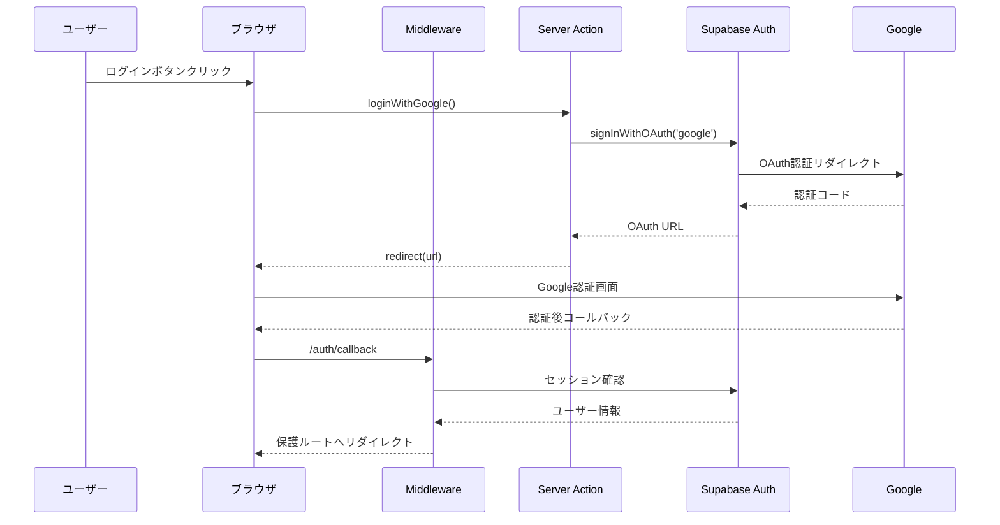

### Magic Link認証フロー
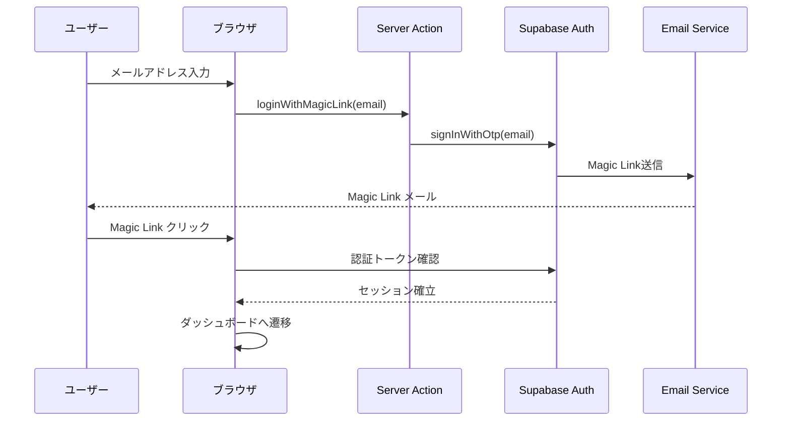

## 2. データ操作フロー

### Server Actions による標準的なデータフロー
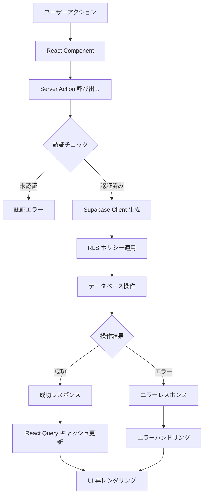

### フラッシュカード作成フロー（具体例）
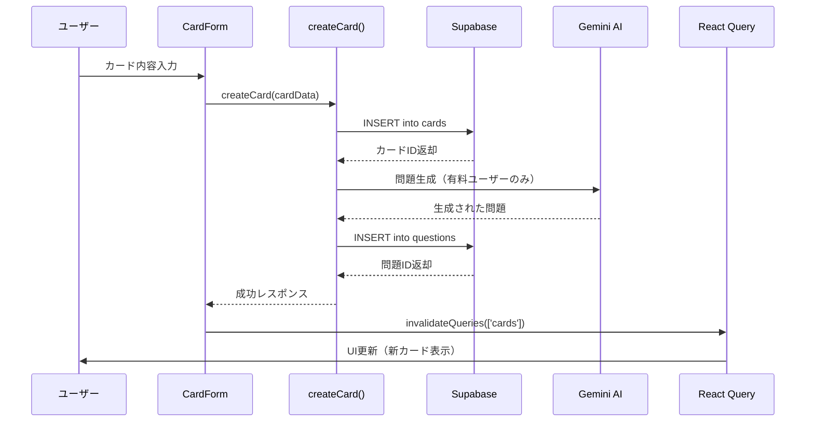

## 3. 状態管理フロー

### React Query による状態管理
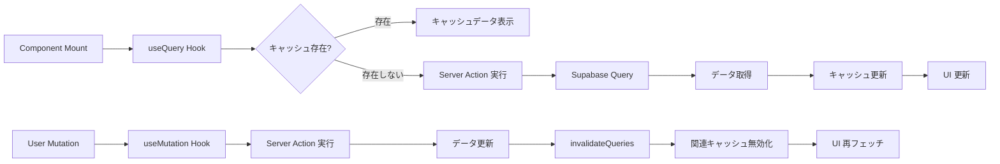

### Jotai による軽量状態管理
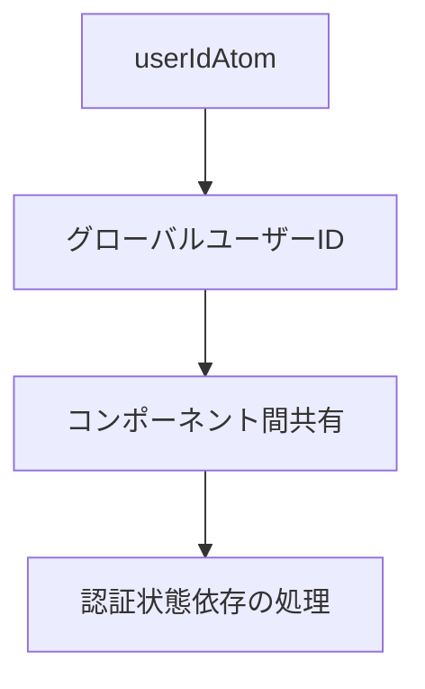

## 4. リアルタイム更新フロー

### ページ編集でのオートセーブ
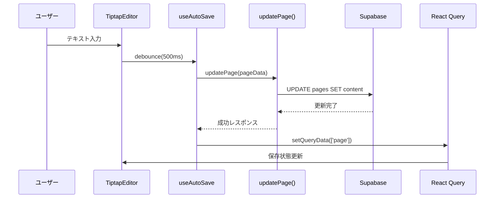

## 5. エラーハンドリングフロー

### 統一エラーハンドリング
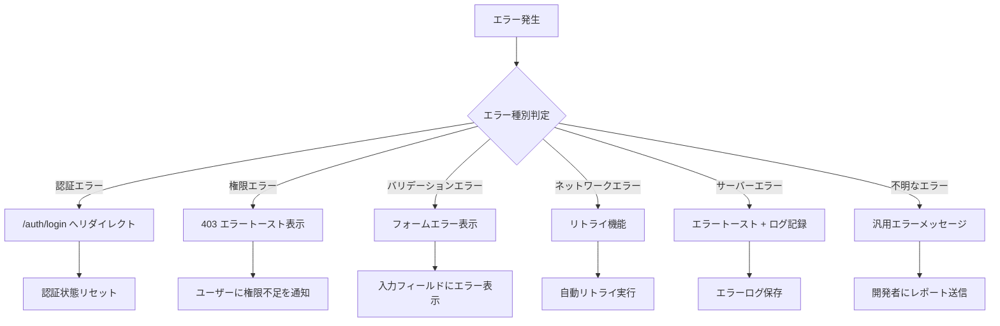

## 6. 外部サービス統合フロー

### AI (Gemini) 統合フロー
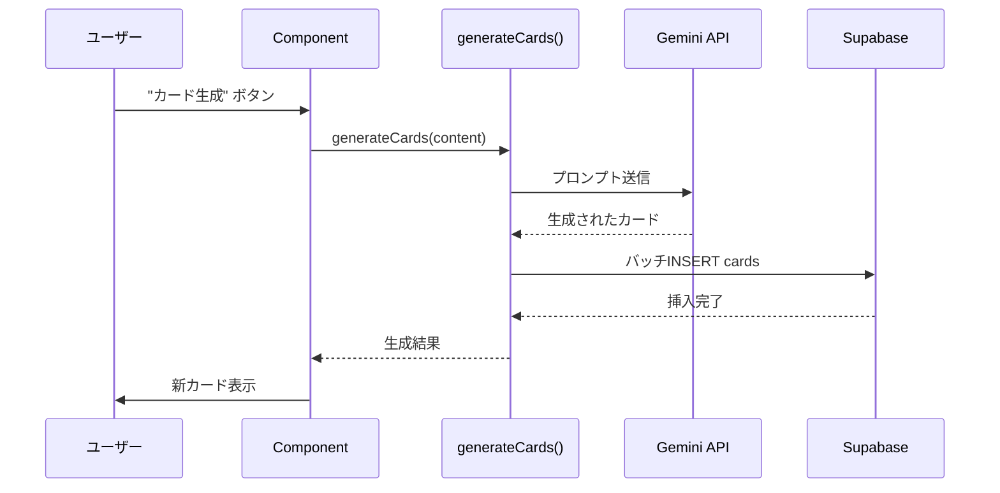

### Gyazo 画像統合フロー
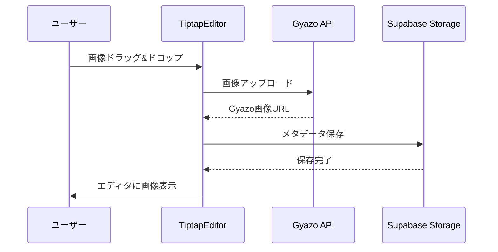

### Cosense (Scrapbox) 同期フロー
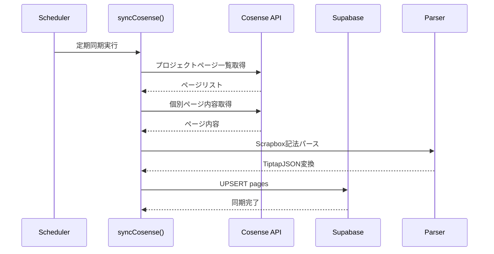

## 7. 学習セッションフロー

### クイズセッション実行フロー
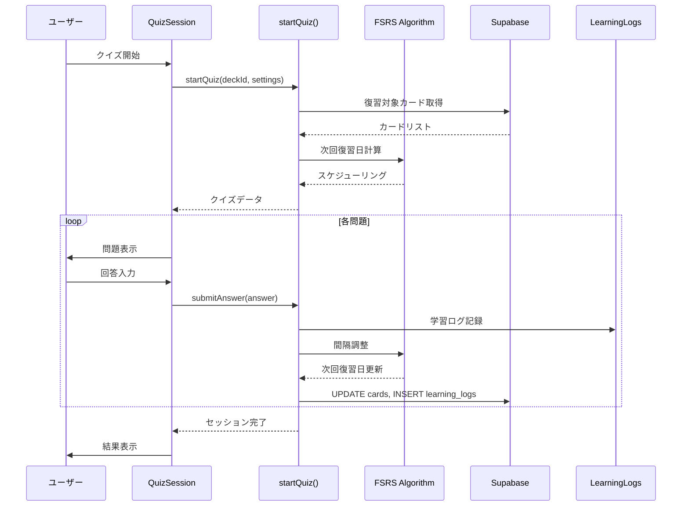

## 8. ファイルアップロード・処理フロー

### 音声ファイル処理フロー
```mermaid
flowchart TD
    A[音声ファイル選択] --> B[ブラウザ圧縮]
    B --> C[Supabase Storage アップロード]
    C --> D[Server Action: transcribe()]
    D --> E[AI 音声認識]
    E --> F[テキスト抽出]
    F --> G[AI 要約・構造化]
    G --> H[フラッシュカード自動生成]
    H --> I[データベース保存]
    I --> J[UI 更新]
```

### 画像OCR処理フロー
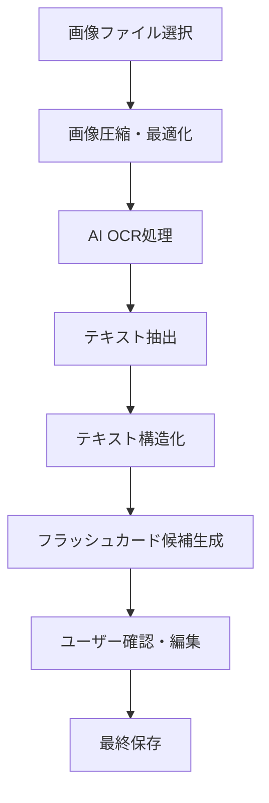

## 9. 検索機能フロー

### 統合検索フロー
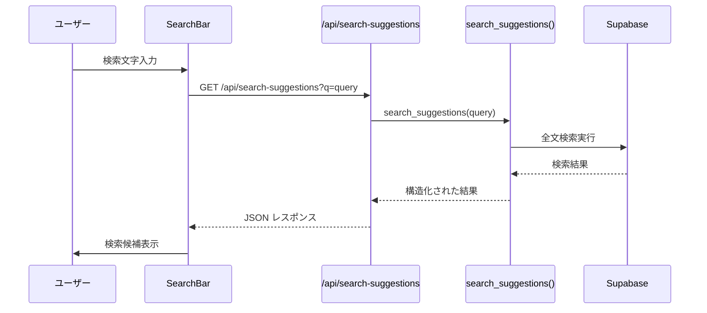

## 10. パフォーマンス最適化フロー

### React Query キャッシュ戦略
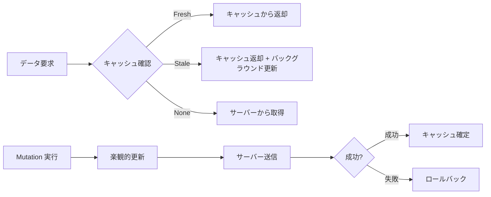

## まとめ

このデータフローは以下の特徴を持っています：

### 優れた点
1. **型安全性**: TypeScript による完全な型チェック
2. **パフォーマンス**: React Query による最適なキャッシュ戦略
3. **セキュリティ**: RLS による行レベルセキュリティ
4. **ユーザビリティ**: 楽観的更新による即座のフィードバック
5. **拡張性**: Server Actions による機能追加の容易さ

### 改善余地
1. **リアルタイム性**: WebSocket による即座の同期
2. **オフライン対応**: PWA による完全なオフライン機能
3. **エラー監視**: より詳細なエラートラッキング
4. **パフォーマンス監視**: リアルタイムパフォーマンス追跡