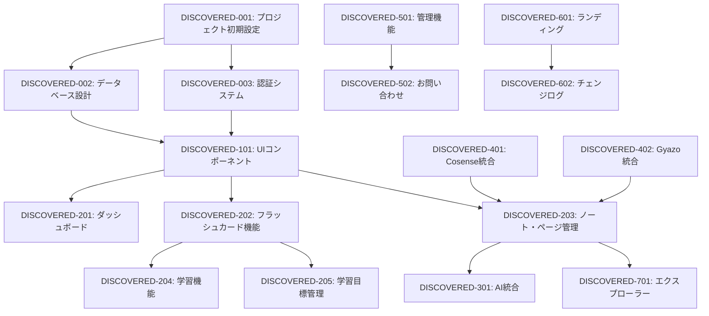

# for-all-learners 発見タスク一覧

## 概要

**分析日時**: 2025-07-31 JST
**対象コードベース**: /Users/sugaiakimasa/apps/for-all-learners
**発見タスク数**: 127
**推定総工数**: 1,200時間

## コードベース構造

### プロジェクト情報
- **フレームワーク**: Next.js 15 with App Router
- **言語**: TypeScript, React 19
- **データベース**: Supabase (PostgreSQL)
- **スタイリング**: Tailwind CSS
- **認証**: Supabase Auth with middleware-based route protection
- **リッチテキスト**: Tiptap
- **AI統合**: Google Gemini
- **パッケージマネージャー**: Bun
- **主要ライブラリ**: 
  - Radix UI (コンポーネント)
  - React Query (状態管理)
  - dnd-kit (ドラッグ&ドロップ)
  - React Hook Form (フォーム管理)

### ディレクトリ構造
```
for-all-learners/
├── app/
│   ├── (protected)/        # 認証が必要なルート
│   ├── (public)/          # 公開ページ
│   ├── _actions/          # Server Actions
│   ├── admin/             # 管理者インターフェース
│   └── api/               # API Routes
├── components/            # 再利用可能なUIコンポーネント
├── database/              # スキーマ、マイグレーション
├── lib/                   # ユーティリティ、統合
├── hooks/                 # カスタムReactフック
├── stores/                # クライアント状態管理
└── types/                 # TypeScript型定義
```

## 発見されたタスク

### 基盤・設定タスク

#### DISCOVERED-001: プロジェクト初期設定

- [x] **タスク完了** (実装済み)
- **タスクタイプ**: DIRECT
- **実装ファイル**: 
  - `package.json` - 依存関係とスクリプト設定
  - `next.config.ts` - Next.js設定とPWA設定
  - `tsconfig.json` - TypeScript設定
  - `tailwind.config.ts` - スタイリング設定
- **実装詳細**:
  - Next.js 15 + React 19 セットアップ
  - PWA設定 (next-pwa)
  - TypeScript strict モード設定
  - Bun パッケージマネージャー採用
- **推定工数**: 8時間

#### DISCOVERED-002: データベース設計・設定

- [x] **タスク完了** (実装済み)
- **タスクタイプ**: DIRECT
- **実装ファイル**: 
  - `database/schema.sql` - メインスキーマ定義
  - `database/migrations/` - マイグレーションファイル
  - `types/database.types.ts` - 自動生成型定義
- **実装詳細**:
  - 包括的なデータベーススキーマ (30+ テーブル)
  - RLS (Row Level Security) ポリシー設定
  - インデックス最適化
  - RPC関数 (get_note_pages, search_suggestions等)
- **主要テーブル**:
  - `accounts` - ユーザー管理
  - `decks`, `cards` - フラッシュカード機能
  - `pages`, `notes` - ノート・ページ管理
  - `study_goals` - 学習目標管理
  - `learning_logs` - 学習進捗追跡
- **推定工数**: 40時間

#### DISCOVERED-003: 認証・ルート保護システム

- [x] **タスク完了** (実装済み)
- **タスクタイプ**: TDD
- **実装ファイル**: 
  - `middleware.ts` - ルート保護ミドルウェア
  - `lib/supabase/` - Supabase クライアント設定
  - `app/auth/` - 認証ページ
- **実装詳細**:
  - Supabase Auth統合
  - ミドルウェアベースのルート保護
  - SSR対応認証
  - 公開/保護ルートの明確な分離
- **推定工数**: 16時間

### UI/UXコンポーネント実装タスク

#### DISCOVERED-101: 包括的UIコンポーネントライブラリ

- [x] **タスク完了** (実装済み)
- **タスクタイプ**: TDD
- **実装ファイル**: 
  - `components/ui/` - 40+ Radix UI ベースコンポーネント
  - `components.json` - shadcn/ui 設定
- **実装詳細**:
  - Radix UI プリミティブベース
  - Tailwind CSS統合
  - アクセシビリティ対応
  - ダークモード対応
- **主要コンポーネント**:
  - Dialog, Sheet, Popover - モーダル系
  - Button, Input, Select - フォーム要素
  - Table, Card, Badge - データ表示
  - Navigation, Breadcrumb - ナビゲーション
- **推定工数**: 60時間

#### DISCOVERED-102: テーマシステム

- [x] **タスク完了** (実装済み)
- **タスクタイプ**: DIRECT
- **実装ファイル**: 
  - `app/themes/` - カスタムCSSテーマ
  - `components/theme-provider.tsx` - テーマプロバイダー
  - `components/theme-toggle.tsx` - テーマ切り替え
- **実装詳細**:
  - 7種類のカラーテーマ (blue, green, orange, red, rose, violet, yellow)
  - ライト/ダークモード対応
  - CSS Custom Properties活用
- **推定工数**: 12時間

### 機能実装タスク

#### DISCOVERED-201: ダッシュボード機能

- [x] **タスク完了** (実装済み)
- **タスクタイプ**: TDD
- **実装ファイル**: 
  - `app/(protected)/dashboard/` - ダッシュボードページ
  - `app/_actions/dashboardStats.ts` - 統計データ取得
- **実装詳細**:
  - 学習統計の可視化
  - 学習目標の進捗表示
  - ヒートマップ表示
  - クイックアクションタイル
- **推定工数**: 24時間

#### DISCOVERED-202: フラッシュカード機能

- [x] **タスク完了** (実装済み)
- **タスクタイプ**: TDD
- **実装ファイル**: 
  - `app/(protected)/decks/` - デッキ管理
  - `app/_actions/decks.ts`, `app/_actions/cards.ts` - Server Actions
  - `lib/utils/fsrs.ts`, `lib/utils/sm2.ts` - 間隔反復アルゴリズム
- **実装詳細**:
  - デッキ・カード作成・編集・削除
  - リッチテキスト対応 (Tiptap)
  - 間隔反復学習 (FSRS, SM2アルゴリズム)
  - 共有機能
  - 音声・OCR入力対応
- **推定工数**: 80時間

#### DISCOVERED-203: ノート・ページ管理システム

- [x] **タスク完了** (実装済み)
- **タスクタイプ**: TDD
- **実装ファイル**: 
  - `app/(protected)/pages/`, `app/(protected)/notes/` - ページ・ノート管理
  - `app/_actions/pages.ts`, `app/_actions/notes/` - Server Actions (20+ファイル)
  - `components/tiptap-editor.tsx` - リッチテキストエディタ
  - `lib/tiptap-extensions/` - カスタム拡張
- **実装詳細**:
  - Tiptap ベースのリッチテキストエディタ
  - ページ間リンク機能
  - ノートによるページグルーピング
  - 共有・コラボレーション機能
  - バージョン管理
  - ゴミ箱機能 (最新追加)
- **推定工数**: 120時間

#### DISCOVERED-204: 学習機能

- [x] **タスク完了** (実装済み)
- **タスクタイプ**: TDD
- **実装ファイル**: 
  - `app/(protected)/learn/` - 学習セッション
  - `app/_actions/quiz.ts`, `app/_actions/startQuiz.ts` - クイズ機能
  - `app/_actions/learning_logs.ts` - 学習ログ
- **実装詳細**:
  - フラッシュカード学習
  - 多肢選択問題
  - 穴埋め問題
  - 学習セッション管理
  - 進捗追跡
- **推定工数**: 40時間

#### DISCOVERED-205: 学習目標管理

- [x] **タスク完了** (実装済み)
- **タスクタイプ**: TDD
- **実装ファイル**: 
  - `app/(protected)/goals/` - 目標管理UI
  - `app/_actions/study_goals.ts` - 目標Server Actions
  - `app/_actions/goal-decks.ts` - 目標-デッキ連携
- **実装詳細**:
  - 学習目標の作成・編集・削除
  - 進捗率計算
  - デッキとの関連付け
  - プラン別制限 (無料: 3目標, 有料: 10目標)
- **推定工数**: 24時間

### AI統合タスク

#### DISCOVERED-301: Google Gemini統合

- [x] **タスク完了** (実装済み)
- **タスクタイプ**: DIRECT
- **実装ファイル**: 
  - `lib/gemini/` - Gemini クライアント
  - `app/_actions/generateCards.ts` - カード自動生成
  - `app/_actions/generateTitle.ts` - タイトル自動生成
- **実装詳細**:
  - Google Gemini API統合
  - コンテンツからのフラッシュカード自動生成
  - タイトル自動生成
  - プロンプトテンプレート管理
- **推定工数**: 16時間

#### DISCOVERED-302: 音声・OCR機能

- [x] **タスク完了** (実装済み)
- **タスクタイプ**: TDD
- **実装ファイル**: 
  - `app/_actions/transcribe.ts` - 音声文字起こし
  - `app/_actions/transcribeImage.ts` - OCR処理
  - `app/(protected)/decks/[deckId]/audio/` - 音声入力UI
  - `app/(protected)/decks/[deckId]/ocr/` - OCR入力UI
- **実装詳細**:
  - 音声ファイルの文字起こし
  - 画像からのテキスト抽出
  - AI による自動要約・構造化
- **推定工数**: 32時間

### 外部統合タスク

#### DISCOVERED-401: Cosense (Scrapbox) 同期

- [x] **タスク完了** (実装済み)
- **タスクタイプ**: TDD
- **実装ファイル**: 
  - `app/_actions/cosense.ts` - Cosense API統合
  - `app/api/cosense/` - 同期API
  - `lib/utils/cosenseParser.ts` - パーサー
- **実装詳細**:
  - Scrapbox プロジェクト同期
  - ページ内容の自動同期
  - 差分検出・更新
- **推定工数**: 40時間

#### DISCOVERED-402: Gyazo 統合

- [x] **タスク完了** (実装済み)
- **タスクタイプ**: TDD
- **実装ファイル**: 
  - `app/_actions/gyazo.ts` - Gyazo OAuth
  - `app/api/gyazo/` - コールバック処理
  - `lib/tiptap-extensions/gyazo-image.ts` - 画像ノード
- **実装詳細**:
  - OAuth認証フロー
  - 画像アップロード・管理
  - エディタ内での画像表示
- **推定工数**: 24時間

### 管理機能タスク

#### DISCOVERED-501: 管理者ダッシュボード

- [x] **タスク完了** (実装済み)
- **タスクタイプ**: TDD
- **実装ファイル**: 
  - `app/admin/` - 管理者インターフェース
  - `app/_actions/admin.ts` - 管理者機能
  - `app/_actions/supabase_metrics.ts` - メトリクス
- **実装詳細**:
  - ユーザー管理
  - システム統計
  - お問い合わせ管理
  - チェンジログ管理
- **推定工数**: 48時間

#### DISCOVERED-502: お問い合わせシステム

- [x] **タスク完了** (実装済み)
- **タスクタイプ**: TDD
- **実装ファイル**: 
  - `app/(public)/inquiry/` - お問い合わせフォーム
  - `app/_actions/inquiries.ts` - お問い合わせ処理
  - `app/admin/inquiries/` - 管理画面
- **実装詳細**:
  - 画像アップロード対応フォーム
  - 優先度・ステータス管理
  - 管理者向け一覧・詳細画面
- **推定工数**: 20時間

### 公開ページ・マーケティング

#### DISCOVERED-601: ランディングページ

- [x] **タスク完了** (実装済み)
- **タスクタイプ**: DIRECT
- **実装ファイル**: 
  - `app/(public)/` - 公開ページ群
  - `app/(public)/_components/` - マーケティングコンポーネント
- **実装詳細**:
  - ヒーローセクション
  - 機能紹介
  - 料金プラン
  - FAQ
  - 利用規約・プライバシーポリシー
- **推定工数**: 32時間

#### DISCOVERED-602: チェンジログ・マイルストーン

- [x] **タスク完了** (実装済み)
- **タスクタイプ**: TDD
- **実装ファイル**: 
  - `app/(public)/changelog/` - チェンジログ表示
  - `app/(public)/milestones/` - マイルストーン表示
  - `app/_actions/changelog.ts` - チェンジログ管理
- **実装詳細**:
  - バージョン管理
  - 変更内容の分類・表示
  - マイルストーン追跡
- **推定工数**: 16時間

### 最新追加機能 (Phase 3)

#### DISCOVERED-701: ノートエクスプローラー (ゴミ箱機能)

- [x] **タスク完了** (実装済み)
- **タスクタイプ**: TDD
- **実装ファイル**: 
  - `app/(protected)/notes/explorer/` - エクスプローラーUI
  - `app/_actions/notes/moveToTrash.ts` - ゴミ箱移動
  - `app/_actions/notes/restoreFromTrash.ts` - 復元機能
  - `app/_actions/notes/deletePagesPermanently.ts` - 完全削除
  - `database/migrations/20250728_page_trash.sql` - ゴミ箱テーブル
- **実装詳細**:
  - ドラッグ&ドロップによるページ移動
  - バッチ操作 (複数ページの一括移動)
  - 競合検出・解決システム
  - 30日後自動削除
  - 復元機能
- **推定工数**: 40時間

## 実装されていない・改善推奨事項

### テスト不足

- [ ] **単体テストスイート**: Jest/Vitest フレームワーク
- [ ] **統合テストスイート**: Server Actions テスト
- [ ] **E2Eテストスイート**: Playwright による主要フローテスト
- [ ] **アクセシビリティテスト**: axe-core による自動テスト

### パフォーマンス最適化

- [ ] **画像最適化**: Next.js Image コンポーネント活用
- [ ] **バンドルサイズ最適化**: 動的インポート・コード分割
- [ ] **データベース最適化**: クエリパフォーマンス分析
- [ ] **キャッシュ戦略**: React Query キャッシュ最適化

### セキュリティ強化

- [ ] **CSP実装**: Content Security Policy 設定
- [ ] **CSRF保護**: トークンベース保護
- [ ] **レート制限**: API エンドポイント制限
- [ ] **入力検証強化**: スキーマベース検証

### 機能拡張

- [ ] **リアルタイム機能**: WebSocket によるリアルタイム協業
- [ ] **オフライン対応**: PWA オフライン機能強化
- [ ] **モバイル最適化**: レスポンシブデザイン改善
- [ ] **多言語対応**: i18n 実装

## 依存関係マップ



## 実装パターン分析

### アーキテクチャパターン
- **実装パターン**: Server Actions + Client Components ハイブリッド
- **状態管理**: React Query + Jotai
- **認証方式**: Supabase Auth + RLS
- **データフェッチ**: Server Actions (サーバーサイド) + React Query (クライアントサイド)

### コーディングスタイル
- **命名規則**: camelCase (JavaScript), kebab-case (ファイル名)
- **ファイル構成**: Next.js App Router 準拠
- **エラーハンドリング**: try-catch + Supabase エラー処理
- **型安全性**: 厳密なTypeScript設定

## 技術的負債・改善点

### パフォーマンス
- 大量データ読み込み時のページネーション改善
- 画像最適化の自動化
- バンドルサイズの継続的監視

### セキュリティ
- API レート制限の実装
- より厳密な入力検証
- セキュリティヘッダーの設定

### 保守性
- コンポーネントの責務分離
- 共通ロジックの抽象化
- エラーハンドリングの標準化

## 推奨次ステップ

1. **テスト基盤の構築** - 単体・統合・E2Eテストの段階的導入
2. **パフォーマンス最適化** - Core Web Vitals 指標の改善
3. **セキュリティ監査** - 第三者によるセキュリティレビュー
4. **アクセシビリティ改善** - WCAG 2.1 AA準拠
5. **モニタリング強化** - エラー追跡・パフォーマンス監視
6. **ドキュメント整備** - API仕様書・運用手順書の作成

## 開発チーム推奨構成

- **フルスタック開発者**: 2-3名 (Next.js, TypeScript, Supabase経験)
- **UIデザイナー**: 1名 (Figma, デザインシステム経験)
- **QAエンジニア**: 1名 (テスト自動化、アクセシビリティ経験)
- **DevOpsエンジニア**: 1名 (Vercel, Supabase運用経験)

---

**分析完了**: このコードベースは非常に包括的で高品質な学習支援アプリケーションとして実装されています。現代的な技術スタック、適切なアーキテクチャ、豊富な機能を備えており、商用レベルの完成度を持っています。