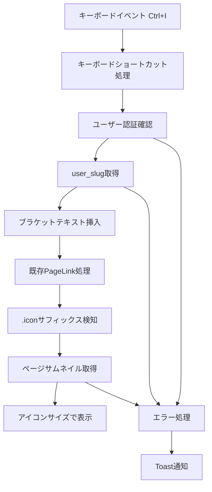

# ユーザーアイコン挿入機能 - 技術要件定義書

## 1. 技術要件セクション

### 1.1 機能概要

**ブラケット記法を拡張したユーザーアイコン挿入機能**

- 既存の`[ページ名]`ブラケット記法を拡張し、`[{user_slug}.icon]`記法でユーザーページのサムネイルをアイコンサイズで表示
- Ctrl+I（Windows）/Cmd+I（Mac）ショートカットで現在ログイン中ユーザーの`[{user_slug}.icon]`を自動挿入
- ユーザーは必ず自身の専用ページ（user_slugと同名のページ）を持つことを前提とする
- 既存のページリンク機能との完全な統合

### 1.2 技術要件

#### 対象コンポーネント
| コンポーネント | 場所 | 対応必要性 | 備考 |
|---|---|---|---|
| PageLink Extension | `lib/tiptap-extensions/page-link.ts` | 必須 | ブラケット記法の拡張 |
| TiptapEditor | `components/tiptap-editor.tsx` | 必須 | キーボードショートカット追加 |
| usePageEditorLogic | `app/(protected)/pages/[id]/_hooks/usePageEditorLogic.ts` | 必須 | ページエディターでの統合 |

#### 依存する既存機能
| 機能 | 実装場所 | 活用方法 |
|---|---|---|
| ブラケット記法 | `lib/tiptap-extensions/page-link.ts` | `.icon`サフィックス検知 |
| ユーザーslug | `database/schema.sql` accounts.user_slug | user_slug特定 |
| ページサムネイル | `pages.thumbnail_url` | アイコン画像取得 |
| 認証情報 | Supabase Auth | 現在ログイン中ユーザー特定 |

### 1.3 キーボードショートカット仕様

#### ショートカットキー
- **Windows/Linux**: `Ctrl + I`
- **Mac**: `Cmd + I`

#### 動作仕様
1. ショートカット検知時、現在のカーソル位置を保持
2. ログイン中ユーザーの`user_slug`を取得
3. `[{user_slug}.icon]`テキストをカーソル位置に挿入
4. 既存のブラケット記法処理により自動的にアイコン表示

#### エラーハンドリング
- ユーザー未認証時：ログイン誘導
- user_slug未設定時：エラー表示
- ユーザーページ未作成時：自動作成または作成誘導

## 2. アーキテクチャセクション

### 2.1 システム構成



### 2.2 データフロー

#### ユーザーアイコン挿入フロー
```typescript
interface UserIconInsertionFlow {
  trigger: KeyboardEvent; // Ctrl/Cmd + I
  authentication: AuthUser; // Supabase認証ユーザー
  userSlug: string; // user_slugの取得
  bracketText: string; // `[{user_slug}.icon]`
  pageLink: PageLinkProcessing; // 既存のページリンク処理
  iconRendering: IconDisplay; // アイコンサイズでの表示
}
```

### 2.3 ブラケット記法拡張設計

#### .iconサフィックス検知ロジック
```typescript
// 既存の正規表現を拡張
const bracketRegex = /\[([^\[\]]+)\]/g;
const iconRegex = /^(.+)\.icon$/; // .iconサフィックス検知

// ブラケット内容の解析
function parseBracketContent(content: string) {
  const iconMatch = content.match(iconRegex);
  if (iconMatch) {
    return {
      type: 'icon',
      slug: iconMatch[1],
      isIcon: true
    };
  }
  return {
    type: 'page',
    slug: content,
    isIcon: false
  };
}
```

#### 表示制御
1. **通常のページリンク**: 既存の処理を継続
2. **アイコンリンク**: サムネイル画像を小さいサイズで表示
3. **フォールバック**: サムネイル未設定時はイニシャルアイコン

### 2.4 実装ファイル構成

#### 修正対象ファイル
```
lib/tiptap-extensions/
└── page-link.ts          # .iconサフィックス処理追加

components/
└── tiptap-editor.tsx     # Ctrl+Iショートカット追加

app/(protected)/pages/[id]/_hooks/
└── usePageEditorLogic.ts # Ctrl+Iショートカット追加
```

#### 新規作成ファイル
```
app/_actions/
└── user-slug.ts          # ユーザーslug取得Server Action

components/ui/
└── user-icon.tsx         # ユーザーアイコン表示コンポーネント
```

### 2.5 Server Action設計

#### getCurrentUserSlug実装
```typescript
export async function getCurrentUserSlug(): Promise<{
  success: boolean;
  userSlug: string | null;
  error?: string;
}> {
  // 1. 認証確認
  // 2. アカウント情報取得
  // 3. user_slug取得
  // 4. エラーハンドリング
}
```

### 2.6 エラーハンドリング戦略

#### エラーケース定義
| エラーケース | 対応方針 | ユーザー体験 |
|---|---|---|
| 未認証ユーザー | ログイン誘導Toast表示 | 機能無効化・説明表示 |
| アバター未設定 | イニシャルアイコン挿入 | 代替表示で機能継続 |
| ネットワークエラー | キャッシュ利用・再試行 | 一時的プレースホルダー |
| 画像読み込み失敗 | フォールバック画像 | デフォルトアイコン表示 |

### 2.7 パフォーマンス最適化

#### キャッシュ戦略
1. **ユーザー情報キャッシュ**: セッション中のアカウント情報保持
2. **画像プリロード**: アバター画像の事前読み込み
3. **デバウンス処理**: 連続実行防止（500ms）

#### 最適化ポイント
- アバター情報の初回取得時キャッシュ
- 画像サイズの適切な設定（64x64px推奨）
- 遅延読み込みによるエディター初期化高速化

### 2.8 セキュリティ考慮事項

#### アクセス制御
- 認証済みユーザーのみ機能利用可能
- 自分のアバターのみ取得可能
- サーバーサイドでの権限確認

#### XSS対策
- アバターURL検証
- サニタイズ処理
- Content Security Policy準拠

### 2.9 テスト戦略

#### 単体テスト対象
1. `UserIconExtension`のキーボードショートカット動作
2. `getUserIconData` Server Actionの各種ケース
3. エラーハンドリング動作

#### 統合テスト対象
1. エディター統合後のショートカット動作
2. 認証状態変更時の動作
3. ネットワーク障害時の動作

### 2.10 実装優先度

#### Phase 1: 基本実装
1. UserIconエクステンション作成
2. キーボードショートカット実装
3. 基本的なアイコン挿入機能

#### Phase 2: 機能拡張
1. エラーハンドリング強化
2. パフォーマンス最適化
3. カスタムNodeView実装

#### Phase 3: 品質向上
1. テストケース追加
2. アクセシビリティ対応
3. ドキュメント整備

## 3. 技術的課題と解決方針

### 3.1 既存エディターとの互換性
**課題**: 2つの異なるTiptapエディター構成への対応
**解決方針**: 
- 共通エクステンションとして実装
- 設定オプションによる柔軟な動作制御
- 既存エクステンションとの競合回避

### 3.2 認証状態の管理
**課題**: エディター内でのユーザー認証状態取得
**解決方針**:
- Server Actionによるサーバーサイド認証確認
- クライアントサイドキャッシュとの同期
- エラー状態の適切なハンドリング

### 3.3 画像の表示制御
**課題**: アバター画像のサイズ・表示形式統一
**解決方針**:
- CSS Classによる統一スタイル適用
- レスポンシブ対応
- アクセシビリティ属性の適切な設定

## 4. 実装後の期待効果

### 4.1 ユーザー体験向上
- メモ記録時の個人特定の容易化
- 協業環境での発言者明確化
- 直感的なキーボード操作による効率化

### 4.2 技術的メリット
- Tiptapエクステンション開発ノウハウ蓄積
- キーボードショートカット機能基盤の確立
- 画像挿入機能の汎用化

### 4.3 将来的な拡張可能性
- 他ユーザーアイコン挿入（@メンション）
- チームメンバー選択機能
- アイコンバリエーション（感情表現など）

---

**実装時の注意事項**:
- 既存のページリンク機能（`[ページ名]`記法）との競合回避
- エディターパフォーマンスへの影響最小化
- 既存のTiptapエクステンションとの統合性確保
