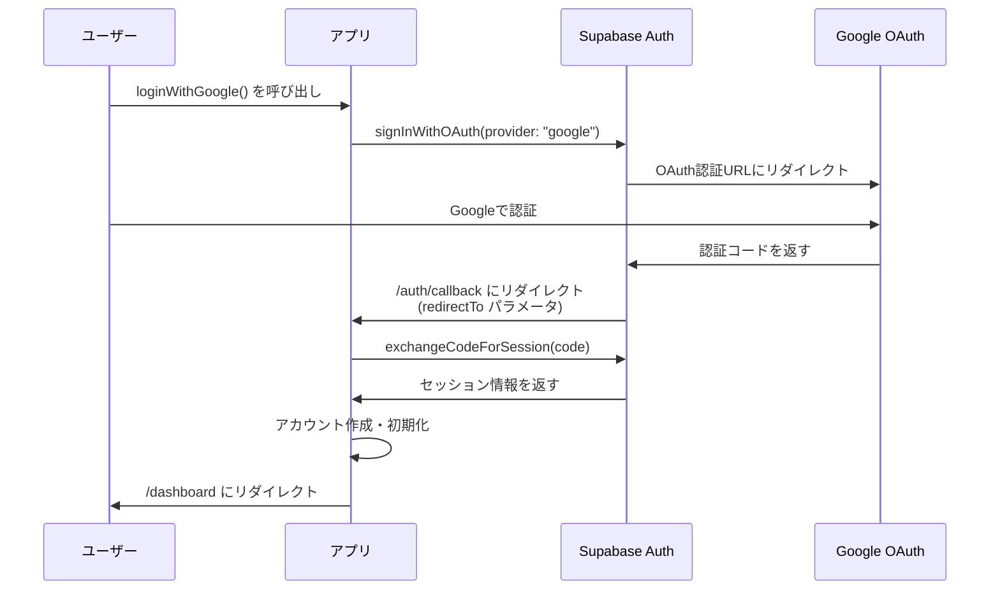
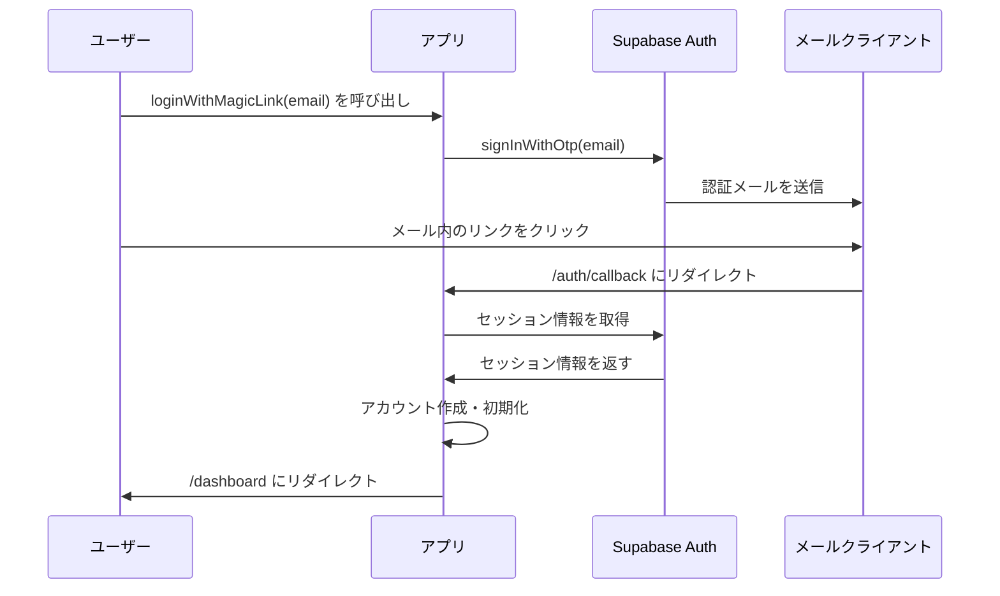
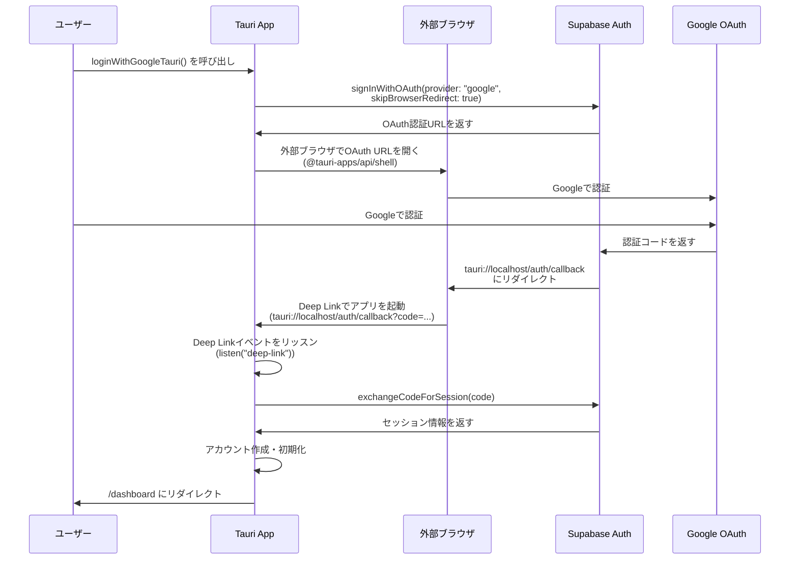
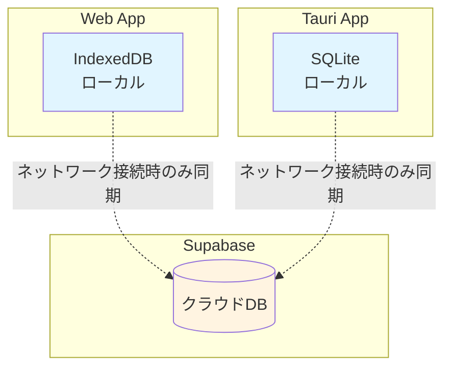
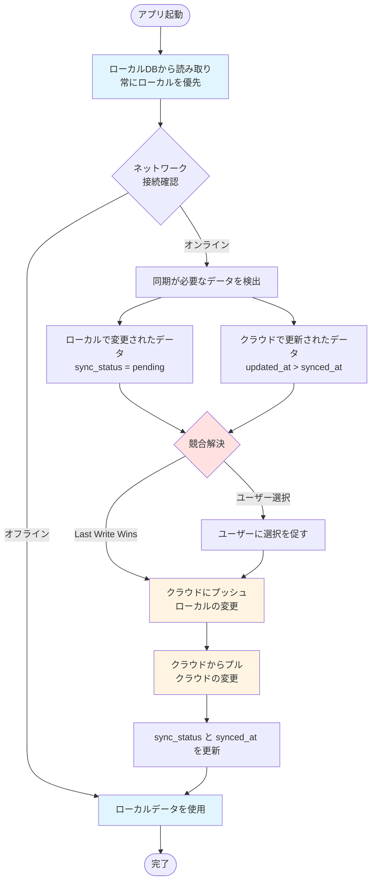

# Supabase Tauri 統合戦略

## 概要

Tauri 2.0 環境での Supabase 接続方法、認証フロー、セッション管理についてまとめます。

**現状**: Next.js アプリケーションでは、サーバー側とクライアント側で異なる Supabase クライアントを使用しています。

**ハイブリッドDB戦略**: WebアプリとネイティブアプリそれぞれでローカルDB（Web: IndexedDB, Tauri: SQLite）を使用し、ネットワーク接続時のみローカルとクラウド（Supabase）を同期する仕組みを採用します。これにより、オフライン時の完全な機能提供とパフォーマンス向上を実現します。

---

## 現状分析

### Supabase クライアントの構成

#### 1. **ブラウザクライアント** (`lib/supabase/client.ts`)
```typescript
"use client";
import { createBrowserClient } from "@supabase/ssr";

export function createClient() {
  return createBrowserClient<Database>(url, key);
}
```

**特徴**:
- クライアント側コンポーネントで使用
- Cookie ベースのセッション管理（`@supabase/ssr` が自動処理）
- ブラウザの localStorage にセッションデータを保存

#### 2. **サーバークライアント** (`lib/supabase/server.ts`)
```typescript
"use server";
import { createServerClient } from "@supabase/ssr";
import { cookies } from "next/headers";

export async function createClient() {
  const cookieStore = await cookies();
  return createServerClient<Database>(url, key, {
    cookies: {
      getAll() { /* ... */ },
      setAll(cookiesToSet) { /* ... */ },
    },
  });
}
```

**特徴**:
- Server Actions や Server Components で使用
- Next.js の `cookies()` API を使用
- SSR 時のセッション管理

#### 3. **認証フロー** (`app/_actions/auth.ts`, `app/auth/callback/route.ts`)

**OAuth フロー**:



**Magic Link フロー**:



---

## Tauri 環境での対応

### 1. Supabase クライアントの設定

#### 問題点
- Tauri の WebView では Cookie の扱いが異なる
- `window.location.origin` が `tauri://localhost` になる
- セッション管理が Cookie ベースから localStorage ベースに変更が必要

#### 解決策: Tauri 対応クライアントの作成

```typescript
// lib/supabase/tauri-client.ts
"use client";

import { createBrowserClient } from "@supabase/ssr";
import type { Database } from "@/types/database.types";

/**
 * Tauri環境とWeb環境の両方に対応したSupabaseクライアント
 */
export function createClient() {
  const url = process.env.NEXT_PUBLIC_SUPABASE_URL;
  const key = process.env.NEXT_PUBLIC_SUPABASE_ANON_KEY;
  
  if (!url || !key) {
    throw new Error(
      "Missing Supabase env vars: NEXT_PUBLIC_SUPABASE_URL or NEXT_PUBLIC_SUPABASE_ANON_KEY",
    );
  }

  const isTauri = typeof window !== 'undefined' && window.__TAURI__;

  // Tauri環境では、カスタムストレージアダプターを使用
  return createBrowserClient<Database>(url, key, {
    auth: {
      // Tauri環境ではカスタムスキームを使用
      redirectTo: isTauri
        ? 'tauri://localhost/auth/callback'
        : `${window.location.origin}/auth/callback`,
      
      // Tauri環境では localStorage を明示的に使用
      storage: isTauri
        ? {
            getItem: (key: string) => {
              return localStorage.getItem(key);
            },
            setItem: (key: string, value: string) => {
              localStorage.setItem(key, value);
            },
            removeItem: (key: string) => {
              localStorage.removeItem(key);
            },
          }
        : undefined, // Web環境ではデフォルトのストレージを使用
      
      // セッションの永続化設定
      persistSession: true,
      autoRefreshToken: true,
      detectSessionInUrl: !isTauri, // Tauri環境ではURL検出を無効化
    },
  });
}
```

**使用方法**:
```typescript
// lib/supabase/client.ts を更新
"use client";

export { createClient } from "./tauri-client";
```

---

### 2. OAuth 認証フローの対応

#### 問題点
- OAuth コールバック URL が `http://localhost` ではなく `tauri://localhost` になる
- Deep Link の処理が必要
- ブラウザのリダイレクトが使えない

#### 解決策: Tauri Deep Link の実装

**Step 1: Tauri 設定** (`src-tauri/tauri.conf.json`)

```json
{
  "app": {
    "windows": [
      {
        "title": "For All Learners",
        "url": "index.html"
      }
    ],
    "security": {
      "csp": "default-src 'self'; connect-src 'self' https://*.supabase.co wss://*.supabase.co"
    },
    "withGlobalTauri": true
  },
  "plugins": {
    "deep-link": {
      "schemes": ["tauri"]
    }
  }
}
```

**Step 2: Rust側のDeep Linkハンドラー** (`src-tauri/src/main.rs`)

```rust
use tauri::Manager;

#[tauri::command]
fn handle_deep_link(url: String) {
    println!("Deep link received: {}", url);
    // URLをパースして認証処理
}

fn main() {
    tauri::Builder::default()
        .plugin(tauri_plugin_deep_link::init())
        .invoke_handler(tauri::generate_handler![handle_deep_link])
        .setup(|app| {
            // Deep Linkイベントリスナー
            app.handle().plugin(
                tauri_plugin_deep_link::Builder::new()
                    .on_deep_link(|app, url| {
                        // JavaScript側にイベントを送信
                        app.emit("deep-link", url).unwrap();
                    })
                    .build(),
            )?;
            Ok(())
        })
        .run(tauri::generate_context!())
        .expect("error while running tauri application");
}
```

**Step 3: TypeScript側のDeep Linkハンドラー**

```typescript
// lib/auth/tauri-auth-handler.ts
"use client";

import { listen } from "@tauri-apps/api/event";
import { getCurrentWindow } from "@tauri-apps/api/window";
import { createClient } from "@/lib/supabase/client";

/**
 * Tauri環境でのOAuth認証コールバックを処理
 */
export async function setupTauriAuthHandler() {
  if (typeof window === 'undefined' || !window.__TAURI__) {
    return; // Web環境では不要
  }

  // Deep Linkイベントをリッスン
  await listen<string>("deep-link", async (event) => {
    const url = event.payload;
    
    // tauri://localhost/auth/callback?code=... の形式を処理
    if (url.startsWith("tauri://localhost/auth/callback")) {
      await handleAuthCallback(url);
    }
  });
}

/**
 * 認証コールバックを処理
 */
async function handleAuthCallback(callbackUrl: string) {
  const supabase = createClient();
  const url = new URL(callbackUrl);
  
  // URLパラメータから認証情報を取得
  const code = url.searchParams.get("code");
  const accessToken = url.searchParams.get("access_token");
  const refreshToken = url.searchParams.get("refresh_token");
  const error = url.searchParams.get("error");
  
  if (error) {
    console.error("OAuth error:", error);
    // エラーページにリダイレクト
    window.location.href = "/auth/login?error=" + encodeURIComponent(error);
    return;
  }
  
  // セッションを設定
  if (accessToken && refreshToken) {
    const { error: sessionError } = await supabase.auth.setSession({
      access_token: accessToken,
      refresh_token: refreshToken,
    });
    
    if (sessionError) {
      console.error("Session error:", sessionError);
      window.location.href = "/auth/login?error=session_failed";
      return;
    }
  } else if (code) {
    const { error: exchangeError } = await supabase.auth.exchangeCodeForSession(code);
    
    if (exchangeError) {
      console.error("Exchange error:", exchangeError);
      window.location.href = "/auth/login?error=exchange_failed";
      return;
    }
  }
  
  // ユーザー情報を取得してアカウント初期化
  const { data: { user } } = await supabase.auth.getUser();
  if (user) {
    await initializeUserAccount(user.id);
  }
  
  // ダッシュボードにリダイレクト
  window.location.href = "/dashboard";
}

/**
 * ユーザーアカウントの初期化（Server Actionsの代替）
 */
async function initializeUserAccount(userId: string) {
  const supabase = createClient();
  
  // アカウント存在確認
  const { data: account } = await supabase
    .from("accounts")
    .select("*")
    .eq("id", userId)
    .single();
  
  if (!account) {
    const { data: { user } } = await supabase.auth.getUser();
    if (!user?.email) return;
    
    // アカウント作成
    const emailSlug = user.email.split("@")[0];
    await supabase.from("accounts").insert({
      id: user.id,
      email: user.email,
      full_name: user.user_metadata?.full_name ?? null,
      avatar_url: user.user_metadata?.avatar_url ?? null,
      user_slug: emailSlug,
    });
    
    // デフォルトノート作成（Server Actionの代替実装が必要）
    // await createDefaultNote(user.id);
  }
}
```

**Step 4: アプリ起動時の初期化**

```typescript
// app/layout.tsx または app/(protected)/layout.tsx
"use client";

import { useEffect } from "react";
import { setupTauriAuthHandler } from "@/lib/auth/tauri-auth-handler";

export default function RootLayout({ children }: { children: React.ReactNode }) {
  useEffect(() => {
    // Tauri環境でのみDeep Linkハンドラーを設定
    if (typeof window !== 'undefined' && window.__TAURI__) {
      setupTauriAuthHandler();
    }
  }, []);

  return (
    <html>
      <body>{children}</body>
    </html>
  );
}
```

**Step 5: OAuth ログインの実装**

Tauri環境でのOAuth認証フロー:



実装例:

```typescript
// lib/auth/tauri-login.ts
"use client";

import { createClient } from "@/lib/supabase/client";
import { open } from "@tauri-apps/api/shell";

/**
 * Tauri環境でのGoogle OAuthログイン
 */
export async function loginWithGoogleTauri() {
  const supabase = createClient();
  const isTauri = typeof window !== 'undefined' && window.__TAURI__;
  
  if (!isTauri) {
    throw new Error("This function is only available in Tauri environment");
  }
  
  const { data, error } = await supabase.auth.signInWithOAuth({
    provider: "google",
    options: {
      redirectTo: "tauri://localhost/auth/callback",
      // Tauri環境では外部ブラウザで開く
      skipBrowserRedirect: true,
    },
  });
  
  if (error) {
    throw new Error(`Google login failed: ${error.message}`);
  }
  
  if (data.url) {
    // 外部ブラウザでOAuth URLを開く
    await open(data.url);
  }
}
```

---

### 3. Magic Link 認証の対応

Magic Link は基本的に OAuth と同じフローですが、メール内のリンクが `tauri://localhost/auth/callback` を指すように設定する必要があります。

```typescript
// lib/auth/tauri-magic-link.ts
"use client";

import { createClient } from "@/lib/supabase/client";

export async function loginWithMagicLinkTauri(email: string) {
  const supabase = createClient();
  
  const { error } = await supabase.auth.signInWithOtp({
    email,
    options: {
      emailRedirectTo: "tauri://localhost/auth/callback",
    },
  });
  
  if (error) {
    throw new Error(`Magic Link login failed: ${error.message}`);
  }
  
  // メール送信成功の通知
  return { success: true, message: "認証メールを送信しました" };
}
```

**注意点**:
- メールクライアントが `tauri://` スキームを開ける必要がある
- iOS/Android では Universal Links / App Links の設定が必要

---

### 4. セッション管理の違い

#### Web環境（現状）
- **Cookie ベース**: `@supabase/ssr` が自動的に Cookie を管理
- **サーバー側アクセス**: Next.js の `cookies()` API でセッションを取得
- **自動リフレッシュ**: Cookie の更新が自動的に反映

#### Tauri環境（移行後）
- **localStorage ベース**: セッションデータを localStorage に保存
- **クライアント側のみ**: サーバー側のセッション管理が不要
- **手動リフレッシュ**: トークンのリフレッシュをクライアント側で管理

#### 実装例: セッション状態の管理

```typescript
// lib/hooks/use-auth.ts
"use client";

import { useEffect, useState } from "react";
import { createClient } from "@/lib/supabase/client";
import type { User } from "@supabase/supabase-js";

export function useAuth() {
  const supabase = createClient();
  const [user, setUser] = useState<User | null>(null);
  const [loading, setLoading] = useState(true);

  useEffect(() => {
    // 初期セッション取得
    supabase.auth.getSession().then(({ data: { session } }) => {
      setUser(session?.user ?? null);
      setLoading(false);
    });

    // 認証状態の変更をリッスン
    const {
      data: { subscription },
    } = supabase.auth.onAuthStateChange((_event, session) => {
      setUser(session?.user ?? null);
      setLoading(false);
    });

    return () => subscription.unsubscribe();
  }, [supabase]);

  return { user, loading };
}
```

---

### 5. RLS (Row Level Security) の動作確認

#### 現状
- Supabase の RLS ポリシーは、クライアント側から直接アクセスしても機能します
- 認証トークンが正しく設定されていれば、サーバー側と同様に動作します

#### 確認事項

**RLS ポリシーの例**:
```sql
-- notes テーブルのRLSポリシー
CREATE POLICY "Users can view their own notes"
  ON notes FOR SELECT
  USING (auth.uid() = owner_id);

CREATE POLICY "Users can create their own notes"
  ON notes FOR INSERT
  WITH CHECK (auth.uid() = owner_id);
```

**動作確認**:
```typescript
// Tauri環境でのRLS動作確認
const supabase = createClient();
const { data: { user } } = await supabase.auth.getUser();

// ユーザーが所有するノートのみ取得できる（RLSが適用される）
const { data, error } = await supabase
  .from("notes")
  .select("*")
  .eq("owner_id", user.id); // RLSにより、この条件は自動的に適用される
```

**注意点**:
- クライアント側から直接アクセスする場合、RLS ポリシーが正しく設定されていることが重要
- サーバー側で行っていた権限チェックが不要になるため、RLS ポリシーの見直しが必要な場合がある

---

### 6. オフライン対応

#### Supabase Realtime の利用

Tauri環境では、Supabase Realtime を使用してオフライン時のデータ同期を実現できます。

```typescript
// lib/hooks/use-realtime-notes.ts
"use client";

import { useEffect, useState } from "react";
import { createClient } from "@/lib/supabase/client";
import type { RealtimePostgresChangesPayload } from "@supabase/supabase-js";

export function useRealtimeNotes(noteId: string) {
  const supabase = createClient();
  const [note, setNote] = useState(null);

  useEffect(() => {
    // 初期データ取得
    supabase
      .from("notes")
      .select("*")
      .eq("id", noteId)
      .single()
      .then(({ data }) => setNote(data));

    // Realtime購読
    const channel = supabase
      .channel(`note:${noteId}`)
      .on(
        "postgres_changes",
        {
          event: "*",
          schema: "public",
          table: "notes",
          filter: `id=eq.${noteId}`,
        },
        (payload: RealtimePostgresChangesPayload<any>) => {
          if (payload.eventType === "UPDATE") {
            setNote(payload.new);
          } else if (payload.eventType === "DELETE") {
            setNote(null);
          }
        }
      )
      .subscribe();

    return () => {
      supabase.removeChannel(channel);
    };
  }, [noteId, supabase]);

  return { note };
}
```

#### ローカルキャッシュ戦略

TanStack Query を使用したオフライン対応:

```typescript
// lib/hooks/use-notes-with-cache.ts
"use client";

import { useQuery, useMutation, useQueryClient } from "@tanstack/react-query";
import { createClient } from "@/lib/supabase/client";

export function useNotes() {
  const supabase = createClient();
  const queryClient = useQueryClient();

  // データ取得（オフライン時はキャッシュを使用）
  const { data: notes, isLoading } = useQuery({
    queryKey: ["notes"],
    queryFn: async () => {
      const { data, error } = await supabase
        .from("notes")
        .select("*")
        .order("updated_at", { ascending: false });
      
      if (error) throw error;
      return data;
    },
    staleTime: 5 * 60 * 1000, // 5分間キャッシュ
    cacheTime: 30 * 60 * 1000, // 30分間キャッシュ保持
  });

  // ノート作成（オフライン対応）
  const createNote = useMutation({
    mutationFn: async (payload: CreateNotePayload) => {
      const { data: { user } } = await supabase.auth.getUser();
      if (!user) throw new Error("Not authenticated");

      const { data, error } = await supabase
        .from("notes")
        .insert([{ owner_id: user.id, ...payload }])
        .select("*")
        .single();
      
      if (error) throw error;
      return data;
    },
    onSuccess: () => {
      queryClient.invalidateQueries({ queryKey: ["notes"] });
    },
    // オフライン時のリトライ設定
    retry: 3,
    retryDelay: 1000,
  });

  return { notes, isLoading, createNote };
}
```

---

### 7. ハイブリッドDB戦略（クラウド + ローカル同期）

#### 概要

WebアプリとネイティブアプリそれぞれでローカルDBを使用し、ネットワーク接続時のみローカルとクラウド（Supabase）を同期する仕組みを実装します。

**メリット**:
- ✅ オフライン時の完全な機能提供
- ✅ パフォーマンス向上（ローカルDBへの高速アクセス）
- ✅ ネットワークコストの削減
- ✅ データの永続化（アプリ再起動後もデータ保持）

**アーキテクチャ**:



#### ローカルDBの選択

##### Web環境: IndexedDB

**理由**:
- ブラウザ標準API（サポート範囲が広い）
- 大量データの保存が可能（数GBまで）
- 非同期API（UIブロッキングなし）
- トランザクション対応

**実装例**:
```typescript
// lib/db/indexeddb-client.ts
"use client";

import { openDB, DBSchema, IDBPDatabase } from "idb";

interface AppDatabase extends DBSchema {
  notes: {
    key: string;
    value: {
      id: string;
      owner_id: string;
      slug: string;
      title: string;
      description: string | null;
      visibility: string;
      updated_at: string;
      synced_at: string | null; // クラウド同期時刻
      sync_status: "pending" | "synced" | "conflict";
    };
    indexes: { "by-owner": string; "by-sync-status": string };
  };
  decks: {
    key: string;
    value: {
      id: string;
      user_id: string;
      title: string;
      description: string | null;
      updated_at: string;
      synced_at: string | null;
      sync_status: "pending" | "synced" | "conflict";
    };
    indexes: { "by-user": string; "by-sync-status": string };
  };
  pages: {
    key: string;
    value: {
      id: string;
      note_id: string;
      user_id: string;
      title: string;
      content_tiptap: any;
      updated_at: string;
      synced_at: string | null;
      sync_status: "pending" | "synced" | "conflict";
    };
    indexes: { "by-note": string; "by-sync-status": string };
  };
}

let dbInstance: IDBPDatabase<AppDatabase> | null = null;

export async function getLocalDB(): Promise<IDBPDatabase<AppDatabase>> {
  if (dbInstance) {
    return dbInstance;
  }

  dbInstance = await openDB<AppDatabase>("for-all-learners", 1, {
    upgrade(db) {
      // Notes store
      if (!db.objectStoreNames.contains("notes")) {
        const notesStore = db.createObjectStore("notes", { keyPath: "id" });
        notesStore.createIndex("by-owner", "owner_id");
        notesStore.createIndex("by-sync-status", "sync_status");
      }

      // Decks store
      if (!db.objectStoreNames.contains("decks")) {
        const decksStore = db.createObjectStore("decks", { keyPath: "id" });
        decksStore.createIndex("by-user", "user_id");
        decksStore.createIndex("by-sync-status", "sync_status");
      }

      // Pages store
      if (!db.objectStoreNames.contains("pages")) {
        const pagesStore = db.createObjectStore("pages", { keyPath: "id" });
        pagesStore.createIndex("by-note", "note_id");
        pagesStore.createIndex("by-sync-status", "sync_status");
      }
    },
  });

  return dbInstance;
}
```

##### Tauri環境: SQLite

**理由**:
- Rust側で直接操作可能（パフォーマンスが高い）
- ファイルベース（バックアップ・移行が容易）
- トランザクション・ACID特性
- 複雑なクエリが可能

**実装例**:

**Rust側** (`src-tauri/src/db.rs`):
```rust
use rusqlite::{Connection, Result};
use serde::{Deserialize, Serialize};

#[derive(Debug, Serialize, Deserialize)]
pub struct Note {
    pub id: String,
    pub owner_id: String,
    pub slug: String,
    pub title: String,
    pub description: Option<String>,
    pub visibility: String,
    pub updated_at: String,
    pub synced_at: Option<String>,
    pub sync_status: String, // "pending" | "synced" | "conflict"
}

pub struct LocalDB {
    conn: Connection,
}

impl LocalDB {
    pub fn new(db_path: &str) -> Result<Self> {
        let conn = Connection::open(db_path)?;
        
        // テーブル作成
        conn.execute(
            "CREATE TABLE IF NOT EXISTS notes (
                id TEXT PRIMARY KEY,
                owner_id TEXT NOT NULL,
                slug TEXT NOT NULL,
                title TEXT NOT NULL,
                description TEXT,
                visibility TEXT NOT NULL,
                updated_at TEXT NOT NULL,
                synced_at TEXT,
                sync_status TEXT NOT NULL DEFAULT 'pending'
            )",
            [],
        )?;
        
        // インデックス作成
        conn.execute(
            "CREATE INDEX IF NOT EXISTS idx_notes_owner ON notes(owner_id)",
            [],
        )?;
        conn.execute(
            "CREATE INDEX IF NOT EXISTS idx_notes_sync_status ON notes(sync_status)",
            [],
        )?;

        Ok(LocalDB { conn })
    }

    pub fn insert_note(&self, note: &Note) -> Result<()> {
        self.conn.execute(
            "INSERT OR REPLACE INTO notes 
            (id, owner_id, slug, title, description, visibility, updated_at, synced_at, sync_status)
            VALUES (?1, ?2, ?3, ?4, ?5, ?6, ?7, ?8, ?9)",
            rusqlite::params![
                note.id,
                note.owner_id,
                note.slug,
                note.title,
                note.description,
                note.visibility,
                note.updated_at,
                note.synced_at,
                note.sync_status
            ],
        )?;
        Ok(())
    }

    pub fn get_pending_sync_notes(&self, owner_id: &str) -> Result<Vec<Note>> {
        let mut stmt = self.conn.prepare(
            "SELECT * FROM notes WHERE owner_id = ?1 AND sync_status = 'pending'"
        )?;
        
        let notes = stmt.query_map([owner_id], |row| {
            Ok(Note {
                id: row.get(0)?,
                owner_id: row.get(1)?,
                slug: row.get(2)?,
                title: row.get(3)?,
                description: row.get(4)?,
                visibility: row.get(5)?,
                updated_at: row.get(6)?,
                synced_at: row.get(7)?,
                sync_status: row.get(8)?,
            })
        })?
        .collect::<Result<Vec<_>>>()?;
        
        Ok(notes)
    }
}
```

**TypeScript側** (`lib/db/tauri-sqlite-client.ts`):
```typescript
"use client";

import { invoke } from "@tauri-apps/api/core";

export interface LocalNote {
  id: string;
  owner_id: string;
  slug: string;
  title: string;
  description: string | null;
  visibility: string;
  updated_at: string;
  synced_at: string | null;
  sync_status: "pending" | "synced" | "conflict";
}

export async function insertLocalNote(note: LocalNote): Promise<void> {
  await invoke("insert_note", { note });
}

export async function getPendingSyncNotes(ownerId: string): Promise<LocalNote[]> {
  return invoke<LocalNote[]>("get_pending_sync_notes", { ownerId });
}
```

#### 同期戦略

**基本方針**:
- **常にローカルDBを優先**: アプリは常にローカルDBから読み取り、オフライン時も完全に動作
- **ネットワーク接続時のみ同期**: オンライン時のみクラウドと同期を実行
- **双方向同期**: ローカル→クラウド（プッシュ）とクラウド→ローカル（プル）の両方を実装
- **競合解決**: 複数デバイス間での競合を適切に処理

##### 双方向同期フロー



##### 実装例: 同期マネージャー

```typescript
// lib/sync/sync-manager.ts
"use client";

import { createClient } from "@/lib/supabase/client";
import { getLocalDB } from "@/lib/db/indexeddb-client"; // Web環境
// import { getPendingSyncNotes } from "@/lib/db/tauri-sqlite-client"; // Tauri環境

interface SyncResult {
  success: boolean;
  pushed: number;
  pulled: number;
  conflicts: number;
  errors: string[];
}

export class SyncManager {
  private supabase = createClient();
  private isOnline = navigator.onLine;
  private syncInProgress = false;

  constructor() {
    // ネットワーク状態の監視
    window.addEventListener("online", () => {
      this.isOnline = true;
      this.sync();
    });
    window.addEventListener("offline", () => {
      this.isOnline = false;
    });

    // 定期的な同期（5分ごと）
    setInterval(() => {
      if (this.isOnline && !this.syncInProgress) {
        this.sync();
      }
    }, 5 * 60 * 1000);
  }

  /**
   * 同期を実行
   */
  async sync(): Promise<SyncResult> {
    if (!this.isOnline || this.syncInProgress) {
      return {
        success: false,
        pushed: 0,
        pulled: 0,
        conflicts: 0,
        errors: ["Offline or sync already in progress"],
      };
    }

    this.syncInProgress = true;

    try {
      // 1. ローカルの変更をクラウドにプッシュ
      const pushResult = await this.pushLocalChanges();

      // 2. クラウドの変更をローカルにプル
      const pullResult = await this.pullCloudChanges();

      // 3. 競合の解決
      const conflicts = await this.resolveConflicts();

      return {
        success: true,
        pushed: pushResult.count,
        pulled: pullResult.count,
        conflicts,
        errors: [],
      };
    } catch (error) {
      return {
        success: false,
        pushed: 0,
        pulled: 0,
        conflicts: 0,
        errors: [error instanceof Error ? error.message : "Unknown error"],
      };
    } finally {
      this.syncInProgress = false;
    }
  }

  /**
   * ローカルの変更をクラウドにプッシュ
   */
  private async pushLocalChanges(): Promise<{ count: number }> {
    const db = await getLocalDB();
    const { data: { user } } = await this.supabase.auth.getUser();
    if (!user) throw new Error("Not authenticated");

    // 同期待ちのノートを取得
    const pendingNotes = await db
      .getAllFromIndex("notes", "by-sync-status", "pending");

    let pushed = 0;

    for (const note of pendingNotes) {
      try {
        // クラウドに存在するか確認
        const { data: existing } = await this.supabase
          .from("notes")
          .select("id, updated_at")
          .eq("id", note.id)
          .single();

        if (existing) {
          // 更新
          const { error } = await this.supabase
            .from("notes")
            .update({
              slug: note.slug,
              title: note.title,
              description: note.description,
              visibility: note.visibility,
              updated_at: note.updated_at,
            })
            .eq("id", note.id);

          if (error) throw error;
        } else {
          // 新規作成
          const { error } = await this.supabase
            .from("notes")
            .insert({
              id: note.id,
              owner_id: note.owner_id,
              slug: note.slug,
              title: note.title,
              description: note.description,
              visibility: note.visibility,
              updated_at: note.updated_at,
            });

          if (error) throw error;
        }

        // 同期状態を更新
        await db.put("notes", {
          ...note,
          synced_at: new Date().toISOString(),
          sync_status: "synced" as const,
        });

        pushed++;
      } catch (error) {
        console.error(`Failed to push note ${note.id}:`, error);
        // エラー時は競合状態にする
        await db.put("notes", {
          ...note,
          sync_status: "conflict" as const,
        });
      }
    }

    return { count: pushed };
  }

  /**
   * クラウドの変更をローカルにプル
   */
  private async pullCloudChanges(): Promise<{ count: number }> {
    const db = await getLocalDB();
    const { data: { user } } = await this.supabase.auth.getUser();
    if (!user) throw new Error("Not authenticated");

    // 最後の同期時刻を取得
    const lastSync = localStorage.getItem("last_sync_time");
    const lastSyncTime = lastSync ? new Date(lastSync) : new Date(0);

    // クラウドから更新されたデータを取得
    const { data: cloudNotes, error } = await this.supabase
      .from("notes")
      .select("*")
      .eq("owner_id", user.id)
      .gt("updated_at", lastSyncTime.toISOString())
      .order("updated_at", { ascending: false });

    if (error) throw error;

    let pulled = 0;

    for (const cloudNote of cloudNotes || []) {
      const localNote = await db.get("notes", cloudNote.id);

      if (!localNote) {
        // 新規データ
        await db.put("notes", {
          id: cloudNote.id,
          owner_id: cloudNote.owner_id,
          slug: cloudNote.slug,
          title: cloudNote.title,
          description: cloudNote.description,
          visibility: cloudNote.visibility,
          updated_at: cloudNote.updated_at,
          synced_at: cloudNote.updated_at,
          sync_status: "synced" as const,
        });
        pulled++;
      } else if (localNote.sync_status === "synced") {
        // ローカルに変更がない場合はクラウドのデータで上書き
        await db.put("notes", {
          ...localNote,
          slug: cloudNote.slug,
          title: cloudNote.title,
          description: cloudNote.description,
          visibility: cloudNote.visibility,
          updated_at: cloudNote.updated_at,
          synced_at: cloudNote.updated_at,
        });
        pulled++;
      } else if (localNote.sync_status === "pending") {
        // ローカルに変更がある場合は競合状態にする
        await db.put("notes", {
          ...localNote,
          sync_status: "conflict" as const,
        });
      }
    }

    // 最後の同期時刻を更新
    localStorage.setItem("last_sync_time", new Date().toISOString());

    return { count: pulled };
  }

  /**
   * 競合の解決
   */
  private async resolveConflicts(): Promise<number> {
    const db = await getLocalDB();
    const conflicts = await db
      .getAllFromIndex("notes", "by-sync-status", "conflict");

    // 現在は Last Write Wins 戦略（ローカルの変更を優先）
    // 将来的にはユーザーに選択を促すUIを実装
    for (const conflict of conflicts) {
      await this.pushLocalChanges(); // ローカルの変更を強制プッシュ
    }

    return conflicts.length;
  }
}

// シングルトンインスタンス
export const syncManager = new SyncManager();
```

#### 競合解決戦略

複数デバイス間でのデータ競合を適切に処理するための戦略を実装します。

##### 競合の検出

競合は以下の場合に発生します：
1. **同時編集**: 複数デバイスで同じデータを同時に編集
2. **オフライン編集**: デバイスAがオフライン中にデバイスBがデータを更新し、その後デバイスAがオンラインに戻った時
3. **削除競合**: 一方のデバイスで削除、もう一方で更新

##### 競合解決の戦略

**1. Last Write Wins (LWW) - 推奨（初期実装）**

最もシンプルで実装が容易。最後に更新されたデータを優先。

```typescript
// lib/sync/conflict-resolver.ts
"use client";

export class ConflictResolver {
  /**
   * Last Write Wins 戦略で競合を解決
   */
  resolveLWW(local: LocalNote, cloud: CloudNote): LocalNote {
    const localTime = new Date(local.updated_at).getTime();
    const cloudTime = new Date(cloud.updated_at).getTime();

    if (localTime >= cloudTime) {
      // ローカルの変更を優先
      return {
        ...local,
        sync_status: "synced",
        synced_at: new Date().toISOString(),
      };
    } else {
      // クラウドの変更を優先
      return {
        ...cloud,
        sync_status: "synced",
        synced_at: cloud.updated_at,
      };
    }
  }
}
```

**2. マージ戦略（将来実装）**

可能な限り両方の変更を統合。テキストフィールドなど、マージ可能なデータに適用。

```typescript
export class ConflictResolver {
  /**
   * マージ可能なフィールドを統合
   */
  resolveMerge(local: LocalNote, cloud: CloudNote): LocalNote {
    // タイトル: より長い方を優先（または最新）
    const title = local.title.length > cloud.title.length 
      ? local.title 
      : cloud.title;

    // 説明: 両方を結合（重複チェック）
    const description = this.mergeDescriptions(
      local.description,
      cloud.description
    );

    return {
      ...local,
      title,
      description,
      updated_at: new Date().toISOString(),
      sync_status: "synced",
      synced_at: new Date().toISOString(),
    };
  }

  private mergeDescriptions(
    local: string | null,
    cloud: string | null
  ): string | null {
    if (!local) return cloud;
    if (!cloud) return local;
    if (local === cloud) return local;
    
    // 重複しない部分を結合
    return `${local}\n\n---\n\n${cloud}`;
  }
}
```

**3. ユーザー選択（将来実装）**

競合時にユーザーに選択を促すUIを表示。

```typescript
// lib/sync/conflict-ui.tsx
"use client";

import { useState } from "react";
import { Dialog, DialogContent, DialogHeader, DialogTitle } from "@/components/ui/dialog";
import { Button } from "@/components/ui/button";

interface ConflictResolutionDialogProps {
  local: LocalNote;
  cloud: CloudNote;
  onResolve: (choice: "local" | "cloud" | "merge") => void;
}

export function ConflictResolutionDialog({
  local,
  cloud,
  onResolve,
}: ConflictResolutionDialogProps) {
  return (
    <Dialog open={true}>
      <DialogContent>
        <DialogHeader>
          <DialogTitle>データの競合を検出しました</DialogTitle>
        </DialogHeader>
        <div className="space-y-4">
          <div>
            <h3>ローカルの変更</h3>
            <p>タイトル: {local.title}</p>
            <p>更新日時: {new Date(local.updated_at).toLocaleString()}</p>
          </div>
          <div>
            <h3>クラウドの変更</h3>
            <p>タイトル: {cloud.title}</p>
            <p>更新日時: {new Date(cloud.updated_at).toLocaleString()}</p>
          </div>
          <div className="flex gap-2">
            <Button onClick={() => onResolve("local")}>
              ローカルの変更を保持
            </Button>
            <Button onClick={() => onResolve("cloud")}>
              クラウドの変更を保持
            </Button>
            <Button onClick={() => onResolve("merge")}>
              両方をマージ
            </Button>
          </div>
        </div>
      </DialogContent>
    </Dialog>
  );
}
```

##### 同期のタイミングとトリガー

**自動同期のタイミング**:
1. **アプリ起動時**: ネットワーク接続を確認し、必要に応じて同期
2. **ネットワーク接続復帰時**: `online` イベントで自動同期
3. **定期的な同期**: 5分ごとにバックグラウンド同期
4. **データ変更時**: 重要な操作（作成・更新・削除）の直後に同期

**手動同期**:
- ユーザーが明示的に「同期」ボタンを押した時
- 設定画面から「今すぐ同期」を実行した時

```typescript
// lib/sync/sync-triggers.ts
"use client";

import { syncManager } from "./sync-manager";

export class SyncTriggers {
  constructor() {
    // ネットワーク状態の監視
    window.addEventListener("online", () => {
      syncManager.sync();
    });

    // 定期的な同期（5分ごと）
    setInterval(() => {
      if (navigator.onLine) {
        syncManager.sync();
      }
    }, 5 * 60 * 1000);

    // ページ表示時の同期（Visibility API）
    document.addEventListener("visibilitychange", () => {
      if (!document.hidden && navigator.onLine) {
        syncManager.sync();
      }
    });
  }

  /**
   * データ変更後の即座同期
   */
  async syncAfterMutation() {
    // 重要度の高い操作の直後に同期
    await syncManager.sync();
  }
}
```

##### パフォーマンス最適化

**1. 差分同期**

変更されたデータのみを同期し、ネットワーク負荷を削減。

```typescript
// lib/sync/diff-sync.ts
"use client";

export class DiffSync {
  /**
   * 変更されたフィールドのみを抽出
   */
  getChangedFields(local: LocalNote, cloud: CloudNote): Partial<LocalNote> {
    const changes: Partial<LocalNote> = {};

    if (local.title !== cloud.title) changes.title = local.title;
    if (local.description !== cloud.description) changes.description = local.description;
    if (local.visibility !== cloud.visibility) changes.visibility = local.visibility;

    return changes;
  }

  /**
   * 差分のみをクラウドに送信
   */
  async pushDiff(noteId: string, changes: Partial<LocalNote>) {
    const supabase = createClient();
    await supabase
      .from("notes")
      .update(changes)
      .eq("id", noteId);
  }
}
```

**2. バッチ同期**

複数の変更をまとめて同期し、リクエスト数を削減。

```typescript
export class SyncManager {
  private pendingChanges: Map<string, LocalNote> = new Map();

  /**
   * 変更をキューに追加（即座に同期しない）
   */
  queueChange(note: LocalNote) {
    this.pendingChanges.set(note.id, note);
  }

  /**
   * キューに溜まった変更を一括同期
   */
  async syncBatch() {
    if (this.pendingChanges.size === 0) return;

    const changes = Array.from(this.pendingChanges.values());
    this.pendingChanges.clear();

    // バッチリクエストで一括送信
    const supabase = createClient();
    const { error } = await supabase
      .from("notes")
      .upsert(changes.map(note => ({
        id: note.id,
        owner_id: note.owner_id,
        slug: note.slug,
        title: note.title,
        description: note.description,
        visibility: note.visibility,
        updated_at: note.updated_at,
      })));

    if (error) {
      // エラー時はキューに戻す
      changes.forEach(note => this.pendingChanges.set(note.id, note));
      throw error;
    }
  }
}
```

**3. インデックス最適化**

同期ステータスによるインデックスで、同期待ちデータの検索を高速化。

```typescript
// IndexedDB のインデックス設定（既に実装済み）
notesStore.createIndex("by-sync-status", "sync_status");

// SQLite のインデックス設定
CREATE INDEX IF NOT EXISTS idx_notes_sync_status ON notes(sync_status);
CREATE INDEX IF NOT EXISTS idx_notes_synced_at ON notes(synced_at);
```

##### エラーハンドリングとリトライ

```typescript
export class SyncManager {
  private maxRetries = 3;
  private retryDelay = 1000; // 1秒

  /**
   * リトライロジック付き同期
   */
  async syncWithRetry(): Promise<SyncResult> {
    let lastError: Error | null = null;

    for (let attempt = 1; attempt <= this.maxRetries; attempt++) {
      try {
        return await this.sync();
      } catch (error) {
        lastError = error instanceof Error ? error : new Error("Unknown error");
        
        if (attempt < this.maxRetries) {
          // 指数バックオフでリトライ
          await this.delay(this.retryDelay * Math.pow(2, attempt - 1));
        }
      }
    }

    // 全リトライ失敗時はエラーを返す
    return {
      success: false,
      pushed: 0,
      pulled: 0,
      conflicts: 0,
      errors: [lastError?.message || "Sync failed after retries"],
    };
  }

  private delay(ms: number): Promise<void> {
    return new Promise(resolve => setTimeout(resolve, ms));
  }
}
```

#### データアクセスの抽象化

ローカルDBとクラウドDBを透過的に扱うためのラッパー:

```typescript
// lib/db/hybrid-client.ts
"use client";

import { createClient } from "@/lib/supabase/client";
import { getLocalDB } from "@/lib/db/indexeddb-client";
import { syncManager } from "@/lib/sync/sync-manager";

export class HybridDBClient {
  private supabase = createClient();
  private isOnline = navigator.onLine;

  /**
   * ノート一覧を取得（常にローカルから読み取り）
   */
  async getNotes(): Promise<LocalNote[]> {
    const db = await getLocalDB();
    const { data: { user } } = await this.supabase.auth.getUser();
    if (!user) throw new Error("Not authenticated");

    // ローカルDBから取得
    const notes = await db.getAllFromIndex("notes", "by-owner", user.id);

    // オンライン時はバックグラウンドで同期
    if (this.isOnline) {
      syncManager.sync().catch(console.error);
    }

    return notes;
  }

  /**
   * ノートを作成（ローカルに保存し、バックグラウンドで同期）
   */
  async createNote(payload: CreateNotePayload): Promise<LocalNote> {
    const db = await getLocalDB();
    const { data: { user } } = await this.supabase.auth.getUser();
    if (!user) throw new Error("Not authenticated");

    const note: LocalNote = {
      id: crypto.randomUUID(),
      owner_id: user.id,
      ...payload,
      updated_at: new Date().toISOString(),
      synced_at: null,
      sync_status: "pending" as const,
    };

    // ローカルDBに保存
    await db.put("notes", note);

    // オンライン時は即座に同期を試みる
    if (this.isOnline) {
      syncManager.sync().catch(console.error);
    }

    return note;
  }

  /**
   * ノートを更新（ローカルに保存し、バックグラウンドで同期）
   */
  async updateNote(id: string, updates: Partial<LocalNote>): Promise<LocalNote> {
    const db = await getLocalDB();
    const existing = await db.get("notes", id);
    if (!existing) throw new Error("Note not found");

    const updated: LocalNote = {
      ...existing,
      ...updates,
      updated_at: new Date().toISOString(),
      synced_at: null,
      sync_status: "pending" as const,
    };

    await db.put("notes", updated);

    if (this.isOnline) {
      syncManager.sync().catch(console.error);
    }

    return updated;
  }
}

export const hybridDB = new HybridDBClient();
```

#### 使用例

```typescript
// app/(protected)/notes/components/NotesList.tsx
"use client";

import { useQuery, useMutation, useQueryClient } from "@tanstack/react-query";
import { hybridDB } from "@/lib/db/hybrid-client";

export function NotesList() {
  const queryClient = useQueryClient();

  // ローカルDBから読み取り（常にローカルを優先）
  const { data: notes, isLoading } = useQuery({
    queryKey: ["notes"],
    queryFn: () => hybridDB.getNotes(),
    staleTime: 0, // 常に最新データを取得
  });

  // ノート作成
  const createNote = useMutation({
    mutationFn: (payload: CreateNotePayload) => hybridDB.createNote(payload),
    onSuccess: () => {
      queryClient.invalidateQueries({ queryKey: ["notes"] });
    },
  });

  return (
    <div>
      {notes?.map((note) => (
        <div key={note.id}>
          {note.title}
          {note.sync_status === "pending" && <span>同期待ち</span>}
          {note.sync_status === "conflict" && <span>競合あり</span>}
        </div>
      ))}
    </div>
  );
}
```

---

### 8. パフォーマンス最適化

#### 接続プールの最適化

Tauri環境では、Supabase クライアントの接続を最適化できます。

```typescript
// lib/supabase/tauri-client.ts (拡張版)
import { createBrowserClient } from "@supabase/ssr";
import type { Database } from "@/types/database.types";

let supabaseClient: ReturnType<typeof createBrowserClient<Database>> | null = null;

export function createClient() {
  // シングルトンパターンでクライアントを再利用
  if (supabaseClient) {
    return supabaseClient;
  }

  const url = process.env.NEXT_PUBLIC_SUPABASE_URL;
  const key = process.env.NEXT_PUBLIC_SUPABASE_ANON_KEY;
  
  if (!url || !key) {
    throw new Error("Missing Supabase env vars");
  }

  supabaseClient = createBrowserClient<Database>(url, key, {
    auth: {
      // ... 前出の設定
    },
    global: {
      // リクエストタイムアウト設定
      fetch: (url, options = {}) => {
        return fetch(url, {
          ...options,
          signal: AbortSignal.timeout(30000), // 30秒タイムアウト
        });
      },
    },
  });

  return supabaseClient;
}
```

#### バッチリクエストの最適化

複数のクエリを並列実行:

```typescript
// lib/utils/supabase-batch.ts
import { createClient } from "@/lib/supabase/client";

export async function batchFetch<T>(
  queries: Array<() => Promise<T>>
): Promise<T[]> {
  const results = await Promise.all(queries.map((query) => query()));
  return results;
}

// 使用例
const [notes, decks, pages] = await batchFetch([
  () => supabase.from("notes").select("*"),
  () => supabase.from("decks").select("*"),
  () => supabase.from("pages").select("*"),
]);
```

---

## 移行チェックリスト

### 設定
- [ ] Tauri Deep Link プラグインのインストール
- [ ] `tauri.conf.json` にカスタムスキーム設定
- [ ] Supabase ダッシュボードでリダイレクト URL を追加（`tauri://localhost/auth/callback`）

### 認証
- [ ] Tauri対応Supabaseクライアントの実装
- [ ] Deep Linkハンドラーの実装
- [ ] OAuth ログインの Tauri 対応
- [ ] Magic Link の Tauri 対応
- [ ] セッション管理の localStorage 移行

### データアクセス
- [ ] RLS ポリシーの動作確認
- [ ] クライアント側からの直接アクセステスト
- [ ] オフライン対応の実装（TanStack Query + キャッシュ）

### ハイブリッドDB（クラウド + ローカル同期）
- [ ] ローカルDBのセットアップ（Web: IndexedDB, Tauri: SQLite）
- [ ] 同期マネージャーの実装
- [ ] 競合解決戦略の実装（初期は Last Write Wins）
- [ ] 同期トリガーの実装（自動同期・手動同期）
- [ ] 差分同期・バッチ同期の実装
- [ ] エラーハンドリングとリトライロジック
- [ ] 同期状態のUI表示（進捗・エラー表示）
- [ ] オフライン時の動作確認
- [ ] 複数デバイス間での同期テスト

### テスト
- [ ] OAuth 認証フローの動作確認
- [ ] Magic Link 認証フローの動作確認
- [ ] セッション永続化の確認
- [ ] オフライン時の動作確認
- [ ] パフォーマンステスト

---

## トラブルシューティング

### 問題1: OAuth コールバックが動作しない

**原因**: Deep Link の設定が不十分

**解決策**:
1. `tauri.conf.json` の `plugins.deep-link.schemes` を確認
2. Rust側のDeep Linkハンドラーが正しく実装されているか確認
3. ブラウザで `tauri://localhost/auth/callback` を開いて動作確認

### 問題2: セッションが保持されない

**原因**: localStorage への保存が失敗している

**解決策**:
1. Tauri環境での localStorage アクセス権限を確認
2. セッション保存時のエラーログを確認
3. `persistSession: true` が設定されているか確認

### 問題3: RLS ポリシーが適用されない

**原因**: 認証トークンが正しく設定されていない

**解決策**:
1. `supabase.auth.getSession()` でセッションを確認
2. リクエストヘッダーに認証トークンが含まれているか確認
3. Supabase ダッシュボードでRLSポリシーを確認

---

## 参考資料

- [Supabase JavaScript Client](https://supabase.com/docs/reference/javascript/introduction)
- [Supabase Auth Deep Linking](https://supabase.com/docs/guides/auth/deep-linking)
- [Tauri Deep Link Plugin](https://github.com/tauri-apps/plugins-workspace/tree/v2/plugins/deep-link)
- [TanStack Query Documentation](https://tanstack.com/query/latest)

---

## 関連ドキュメント

- [Server Actions移行戦略](./20251109_01_server-actions-migration-strategy.md)
- [Tauri移行計画](../01_issues/open/2025_11/20251109_01_tauri-native-migration.md)

