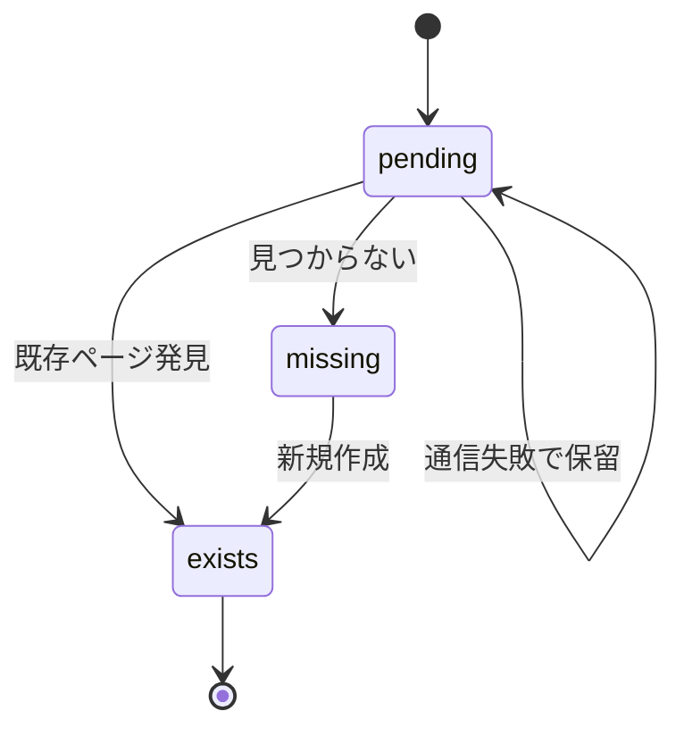
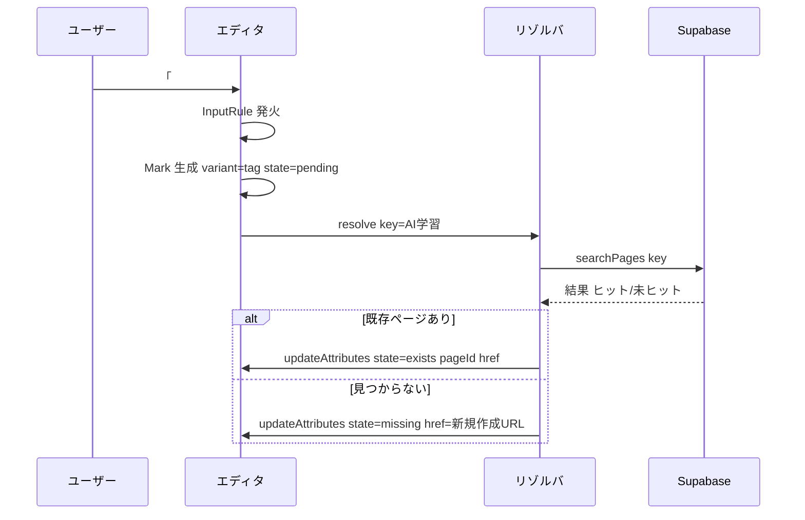
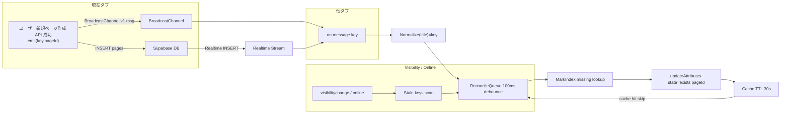

# UnifiedLinkMark 仕様書 (v0.1)

最終更新: 2025-09-23
担当: (記入)
対象ブランチ: `fix/preserve-bold-in-links`

---

## 1. 目的

`[Title]` 形式 (旧 PageLink) と `#タグ` 形式 (新 TagLink) を単一の Mark 実装に統合し、以下を実現する。

- 一貫した属性スキーマと解決(存在判定)ロジック
- 日本語/多言語対応 (全角/半角, サロゲートペア含む)
- 入力直後から「pending → exists/missing」への非同期遷移
- 未存在エンティティのワンクリック (またはキー) 生成
- 将来の別表記 (例: `[[wiki]]`, `@mention`) 追加を低コスト化

## 2. 用語定義

| 用語                                  | 説明                                                           |
| ------------------------------------- | -------------------------------------------------------------- |
| UnifiedLinkMark (MarkType: `unilink`) | 本仕様で新規導入する共通 Mark                                  |
| Variant                               | 入力記法の種類: `bracket` (`[Title]`), `tag` (`#タグ`)         |
| Raw Text                              | ユーザ入力そのまま (プレフィックス含まない)                    |
| Display Text                          | エディタ内表示文字列 (タグの場合 `#` を含めない表示方針を採用) |
| Normalized Key                        | 内部同一性判定キー。正規化規則 §6 参照                         |
| State                                 | `pending` / `exists` / `missing`                               |

## 3. スコープ

### In Scope

- Mark 実装 (schema, commands, input rules)
- 非同期存在解決 (バッチ化は次フェーズ)
- クリック/キー操作での create 流れ
- 既存 `[Title]` Decoration/Mark からの移行
- CSS ステート適用 (既存 `a[data-state]` 再利用)

### Out of Scope (将来)

- バッチ最適化 (request coalescing)
- キャッシュ永続化 (IndexedDB 等)
- 差分同期 (collab 対応)
- Alias/リダイレクトページ

## 4. Mark 属性仕様

| 属性    | 型             | 必須     | 説明                                                       |
| ------- | -------------- | -------- | ---------------------------------------------------------- | ------------ | -------- |
| variant | `'bracket'     | 'tag'`   | Yes                                                        | 入力記法区別 |
| raw     | string         | Yes      | 入力ソース (例: `Title`, `タグ`)                           |
| text    | string         | Yes      | 表示用文字列 (`raw` のトリミング後)                        |
| key     | string         | Yes      | Normalized Key (正規化後)                                  |
| pageId  | string \| null | No       | 既存ページ ID (存在時)                                     |
| href    | string         | Yes      | 内部リンク先 (`/pages/{pageId}` or `/pages/new?title=...`) |
| state   | `'pending'     | 'exists' | 'missing'`                                                 | Yes          | 解決状態 |
| exists  | boolean        | Yes      | state===`exists` の冗長フラグ (CSS / 簡易判定用)           |
| created | boolean        | No       | セッション中に新規生成した場合 true                        |
| meta    | object         | No       | 予約 (将来: alias, locale 等)                              |

不変条件:

- `exists === (state === 'exists')`
- `pageId !== null => state === 'exists'`
- `state === 'missing' => pageId === null`

## 5. ステートマシン



エラー (通信失敗) 時は `pending` 維持 + リトライ (後述 §9)。

## 6. 正規化規則 (Default 案 採用)

1. トリミング: 前後空白除去
2. 連続空白: 単一スペースへ圧縮
3. 全角スペース: 半角スペースへ
4. アンダースコア `_` → スペース (互換性維持)
5. Unicode 正規化 NFC
6. ケース: 現状保持 (Case-sensitive)。将来オプション化。

例:
`" ＃複合＿タグ  テスト"` (入力) → Raw 抽出 `複合＿タグ  テスト` → 正規化後 Key = `複合 タグ テスト`

## 7. 入力検出

### 7.1 Tag Variant

- Trigger: `#` に続く 1〜50 文字 (空白/句読点/# で終了)
- Regex (InputRule): `/\B#([\p{Letter}\p{Number}\p{Mark}\p{Connector_Punctuation}\p{Ideographic}]{1,50})/u`
  - 終端条件: 次文字が空白/行頭/記号類/行末
  - 表示は `text = captured` (先頭 `#` は表示しない仕様)

### 7.2 Bracket Variant

- Trigger: `[Title]` (既存) — 既存移行ロジックを Mark 化
- Migration: 初回ロード時既存 `PageLinkMark` / Decoration を走査し `unilink` へ置換

### 7.3 Suggestion (将来統合)

- 現行 bracket 用 suggestion を共通化し variant 判定 (v0.2)

## 8. 非同期存在解決

### 8.1 アルゴリズム (単一版)

1. Mark 生成時: state=`pending`, pageId=null
2. マイクロタスクキューで resolver enqueue
3. Resolver: `searchPages(normalizedKey)`
4. ヒット:
   - 最良一致 (完全タイトル一致) を採用
   - Mark 更新: { state: 'exists', exists: true, pageId, href: `/pages/${id}` }
5. 未ヒット:
   - Mark 更新: { state: 'missing', exists: false, href: `/pages/new?title=${encodeURIComponent(raw)}` }

### 8.2 リトライ戦略

- ネットワーク失敗時 backoff: 1s / 3s / 10s (最大 3 回) → 失敗継続で hover 時に手動再試行ボタン (v0.2)
- v0.1: シンプルに 1 回失敗で console.warn + pending 維持

## 9. クリック/操作動作

- exists: 通常遷移 (内部 link)
- missing: (改行/クリック) → Page create API 呼出 → 成功後 Mark 更新 state=`exists`, created=true, pageId 設定
- 編集中修飾キー: Cmd+Click で新規タブ (既存 Next link 互換)

## 10. コマンド API (エディタ拡張)

| Command                                      | 引数          | 役割                                    |
| -------------------------------------------- | ------------- | --------------------------------------- |
| `insertUnifiedLink({ variant, raw? text? })` | variant + raw | Mark 生成 (正規化/解決自動)             |
| `refreshUnifiedLinks()`                      | -             | 全 Mark 再解決 (キャッシュクリア後など) |
| `createMissingUnifiedLink(markPos)`          | pos           | missing → exists (新規ページ生成)       |

## 11. DOM / CSS

- TagName: `a` (従来互換) `class="unilink unilink--{variant}"`
- data 属性: `data-variant`, `data-state`, `data-exists`, `data-created`
- 既存 `a[data-state]` ルール適用、追加で variant 区別: `.unilink--tag { /* optional style */ }`

## 12. 移行計画

| フェーズ | 内容                                              | 対象 PR          |
| -------- | ------------------------------------------------- | ---------------- |
| P1       | Spec ドキュメント (本書)                          | (#)              |
| P2       | `TagMark` 仮実装 (現行独立)                       | PR-TagMark       |
| P3       | `UnifiedLinkMark` 実装 + 既存 `PageLinkMark` 置換 | PR-Unified-Core  |
| P4       | Bracket suggestion を Unified API 化              | PR-Suggest-Union |
| P5       | 旧ファイル削除/クリーンアップ                     | PR-Cleanup       |

Rollback: 各フェーズで feature flag `UNILINK_ENABLED` チェック可能に (env or editor prop)。

## 13. 互換性 / データストレージ

- 現行保存フォーマット: ProseMirror JSON に Mark 属性として埋込
- 旧 `PageLinkMark` 属性との差: `pageTitle` -> `text`, `plId` -> 廃止, `exists/state` 維持
- ロード時: 旧属性検出 → mapping → `unilink` 生成 (P3)

## 14. エッジケース

| ケース                  | 挙動                                  |
| ----------------------- | ------------------------------------- |
| 空タグ `#` 単独         | 無視 (InputRule 不成立)               |
| 51 文字超過             | 途中で確定せず通常テキスト            |
| 末尾で未解決 (通信失敗) | pending 表示維持, 再編集で再試行      |
| 同一タグ連続 `#tag#tag` | 2 個検出 (境界は非文字か先頭/終端)    |
| 全角記号混在            | 正規化後 key 生成; 不正文字はマッチ外 |

## 15. 簡易シーケンス (Tag 入力)



## 16. パフォーマンス考慮 (v0.1)

- 解決はアイテム毎 (N クエリ) 実装。N が大きい文章は将来バッチに集約。
- DOM Mutation 最小化: Mark 更新は `tr.addMark/removeMark` ではなく `updateAttributes` 利用。

## 17. テスト計画

| テスト                   | 内容                                    |
| ------------------------ | --------------------------------------- |
| InputRule-tag-basic      | `#テスト` → unilink(tag) pending        |
| Resolve-exists           | モック API で exists へ遷移             |
| Resolve-missing          | 未ヒット → missing                      |
| Migration-bracket        | 既存 `[Title]` JSON → unilink(bracket)  |
| Create-missing           | missing マーク create コマンド後 exists |
| Normalization-underscore | `#Hello_World` key=`Hello World`        |
| Unicode-normalization    | 合成文字列 NFC 統合                     |

## 18. セキュリティ / 安全性

- XSS: `text` はプレーンテキスト (HTML エスケープ) で表示。
- href: 内部パスのみ構築。外部リンクは variant 拡張時に別ガード追加予定。

## 19. 将来拡張候補

- `@mention` variant 追加
- バッチ検索 API / キャッシュレイヤ
- Hover Preview (ページ要約表示)
- 存在判定のインクリメンタル更新 (コラボ編集)
- 別名 (alias) / リダイレクト

## 20. オープン課題 (デフォルト案で仮決定、後で再検討)

| ID  | 課題             | 現行方針                                        |
| --- | ---------------- | ----------------------------------------------- |
| O1  | Case sensitivity | Case-sensitive 維持                             |
| O2  | 失敗リトライ     | v0.1 スキップ (pending 維持)                    |
| O3  | Batch resolver   | v0.2 以降                                       |
| O4  | Display vs key   | key にのみ正規化適用、display は raw トリミング |
| O5  | Tag `#` 表示     | 非表示 (仕様採用)                               |

## 21. 実装チェックリスト (P3 時)

- [ ] Mark schema 登録
- [ ] InputRules (tag / bracket) 実装
- [ ] Resolver queue 実装
- [ ] Commands 3 種実装
- [ ] Migration routine
- [ ] Click handler (missing create)
- [ ] CSS クラス付与 / 既存ルール再利用
- [ ] 基本テスト 7 件

---

以上。

## 22. リアルタイム自動再解決 (追加仕様 v0.1r)

目的: ユーザー操作無しで `missing` → `exists` へ自動遷移させる。自タブ / 複数タブ / 他ユーザー作成に対応しつつサーバ負荷を最小化。

### 22.1 要件

- ページ (title=key) が新規作成されたら関連 missing Mark を 5 秒以内に `exists` 化
- 同一 key の不要な重複 API 呼び出し抑制 (デデュープ)
- オフライン時: 復帰 (online イベント or visibilitychange) で差分同期
- 他ユーザー作成も反映 (Supabase Realtime 利用)

### 22.2 データフロー概要



### 22.3 コンポーネント

| Layer            | 役割                                                                    |
| ---------------- | ----------------------------------------------------------------------- |
| RealtimeListener | Supabase Realtime `pages` テーブル INSERT 購読し key 抽出               |
| LocalEmitter     | 新規作成 API 成功時に BroadcastChannel へ {key,pageId} 送信             |
| ChannelRouter    | BroadcastChannel 受信を ReconcileQueue へ転送                           |
| ReconcileQueue   | 同一 key の連続イベントを 100ms デバウンスし 1 回処理                   |
| MarkIndex        | エディタ状態から `missing` マークを key→positions Map 化 (lazy refresh) |
| Cache            | `resolved[key]={pageId, ts}` 30s TTL, 再解決抑止                        |

### 22.4 MarkIndex 戦略

- 初回要求時に全文走査し Map 構築: `Map<key, Array<position>>`
- 以後: トランザクション適用フックで挿入/削除差分更新 (パフォーマンス最適化) — v0.1 は毎イベントで軽量再スキャン (段落数小規模前提)

### 22.5 Reconcile ロジック

Pseudo:

```
onKeyEvent(key, pageId?) {
  if(cache.hitFresh(key)) return
  if(!pageId) pageId = fetchPageIdByKey(key) // fallback (exists 確認)
  if(!pageId) return // まだ存在しない
  positions = markIndex.get(key)
  for(pos of positions) updateMark(pos, { state:'exists', exists:true, pageId, href:`/pages/${pageId}` })
  cache.store(key, pageId)
}
```

### 22.6 Supabase Realtime 詳細

- チャネル: `pages` (RLS 適用後、権限あるレコードのみ受信)
- フィルタ: 可能なら server-side で title カラムのみ受信 (payload 最小化)
- 再接続: onClose → backoff 1s/3s/5s

### 22.7 BroadcastChannel

- 名前: `unilink-page-created`
- メッセージ shape: `{ v:1, key:string, pageId:string }`
- 受信時: 即 `onKeyEvent(key, pageId)`

### 22.8 Visibility / Online イベント

- `visibilitychange` と `online` で: 未解決 cache 失効キー (older than TTL) のみまとめて `fetchPagesByKeys([..])` (将来バッチ API)。
- v0.1: キーごと逐次 `searchPages` (件数小前提)

### 22.9 キャッシュ / TTL

- TTL 30s (調整可)
- Realtime/Broadcast により更新されたキーは ts 更新
- 失効時かつ missing のままなら再同期候補

### 22.10 競合 / 冪等性

- 複数イベント同一 key: ReconcileQueue 100ms デバウンス
- 既に exists の Mark は skip
- pageId 不一致 (理論上 rename/alias): 先着優先。将来 alias 実装時に再設計。

### 22.11 エラー処理

- Realtime 接続断: ローカル/タブイベントで部分維持 → 復帰後 visibility フックで補完
- searchPages 失敗: ログ + 次イベント待ち (再試行しない)

### 22.12 メトリクス (オプション)

| Metric                        | 説明                  |
| ----------------------------- | --------------------- |
| `unilink.realtime.event`      | Realtime 受信件数     |
| `unilink.broadcast.receive`   | タブ間受信            |
| `unilink.reconcile.updated`   | missing→exists 更新数 |
| `unilink.reconcile.cache_hit` | キャッシュ命中        |

### 22.13 セキュリティ考慮

- BroadcastChannel: 同一オリジンのみ。不要データ送信禁止。
- Realtime: RLS で非公開ページ (他ユーザー) のみ許可されたものを受信。

### 22.14 導入順序

1. BroadcastChannel + ReconcileQueue + MarkIndex 簡易実装
2. Supabase Realtime 追加
3. Visibility/Online パッシブ補完
4. 差分 Index 更新 (高パフォーマンス最適化)

### 22.15 テスト追加

- Realtime 模擬: モックイベント投入で missing→exists
- BroadcastChannel: 2 インスタンス疑似 (polyfill) で同期確認
- 重複イベント: デバウンス動作検証
- TTL 失効後再解決: cache 無効化シナリオ

---
