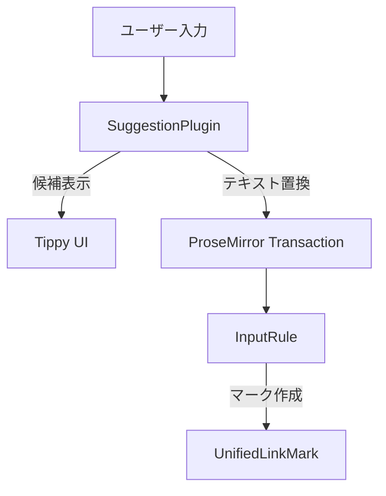

# サジェスチョン機能再設計 実装計画書

## 📝 プロジェクト概要

**目的**: UnifiedLinkMarkエディタのサジェスチョン機能を、シンプルで確実な「テキスト置換型」機能として再設計する

**対象ファイル**: `lib/tiptap-extensions/unified-link-mark/plugins/suggestion-plugin.ts`

**実装期間**: 2025年10月26日〜

---

## 🎯 新しい仕様設計

### 基本コンセプト

```
入力テキスト → 候補表示 → 選択 → テキスト置換のみ
```

**重要な原則**:
- サジェスチョン機能は **テキスト置換のみ** を行う
- UnifiedLinkMarkの作成は **InputRule に完全委任**
- 二重処理・重複処理を完全に排除

### 対応パターン

#### 1. ブラケット記法: `[テキスト]`

**トリガー条件**:
```
[テキスト| ← カーソル位置（閉じ括弧の前）
```

**動作**:
1. `[` と `]` の間にあるテキストで候補検索
2. ユーザーが候補を選択
3. `テキスト` 部分を選択した候補タイトルに **置換のみ**
4. 結果: `[選択した候補タイトル]` 
5. InputRuleが`]`の入力でUnifiedLinkMarkに変換

#### 2. タグ記法: `#タグ`

**トリガー条件**:
```
#タグ| ← カーソル位置（タグテキストの末尾）
```

**動作**:
1. `#` 以降のテキストで候補検索
2. ユーザーが候補を選択
3. `タグ` 部分を選択した候補タイトルに **置換のみ**
4. 結果: `#選択した候補タイトル`
5. InputRuleが適切なタイミングでUnifiedLinkMarkに変換

---

## 🏗️ アーキテクチャ設計

### 責任分離



**SuggestionPlugin の責任**:
- ✅ 入力パターンの検出
- ✅ 候補の検索・表示
- ✅ テキストの置換
- ❌ マークの作成（InputRuleに委任）

**InputRule の責任**:
- ✅ マークの作成・管理
- ✅ ページ解決の開始

### 状態管理

```typescript
interface SuggestionState {
  // 基本状態
  active: boolean;
  variant: "bracket" | "tag" | null;
  
  // 検索・候補関連
  query: string;
  results: SearchResult[];
  selectedIndex: number;
  loading: boolean;
  
  // 範囲情報（置換用）
  range: {
    from: number;  // 置換開始位置
    to: number;    // 置換終了位置
  } | null;
}
```

---

## 🔧 詳細な実装仕様

### 1. パターン検出ロジック

#### ブラケット記法の検出

```typescript
function detectBracketPattern(text: string, cursorPos: number) {
  // [テキスト] パターンを検出
  // カーソルが閉じ括弧の直前にある場合のみアクティブ
  
  const openIndex = text.lastIndexOf('[', cursorPos - 1);
  const closeIndex = text.indexOf(']', cursorPos);
  
  if (openIndex !== -1 && closeIndex !== -1 && cursorPos <= closeIndex) {
    return {
      variant: "bracket",
      query: text.slice(openIndex + 1, cursorPos),
      range: { from: openIndex + 1, to: closeIndex }
    };
  }
  return null;
}
```

#### タグ記法の検出

```typescript
function detectTagPattern(text: string, cursorPos: number) {
  // #タグ パターンを検出
  // # 以降のテキスト末尾にカーソルがある場合
  
  const hashIndex = text.lastIndexOf('#', cursorPos - 1);
  if (hashIndex === -1) return null;
  
  const tagText = text.slice(hashIndex + 1, cursorPos);
  // タグは空白で終了
  if (tagText.includes(' ')) return null;
  
  return {
    variant: "tag",
    query: tagText,
    range: { from: hashIndex + 1, to: cursorPos }
  };
}
```

### 2. 候補検索仕様

```typescript
interface SearchResult {
  id: string;        // ページID
  title: string;     // ページタイトル
  slug?: string;     // URL slug
  type: "page";      // 将来の拡張用
}

async function searchCandidates(query: string): Promise<SearchResult[]> {
  // 既存のsearchPages関数を使用
  // 結果は最大10件に制限
  const results = await searchPages(query);
  return results.slice(0, 10);
}
```

### 3. テキスト置換仕様

#### ブラケット記法の置換

```typescript
function replaceBracketText(
  view: EditorView, 
  range: { from: number; to: number }, 
  newText: string
) {
  const tr = view.state.tr;
  
  // [oldText] → [newText] に置換
  tr.replaceWith(range.from, range.to, 
    view.state.schema.text(newText)
  );
  
  view.dispatch(tr);
  // この後、]の入力でInputRuleが発動してマーク化
}
```

#### タグ記法の置換

```typescript
function replaceTagText(
  view: EditorView, 
  range: { from: number; to: number }, 
  newText: string
) {
  const tr = view.state.tr;
  
  // #oldTag → #newTag に置換
  tr.replaceWith(range.from, range.to, 
    view.state.schema.text(newText)
  );
  
  view.dispatch(tr);
  // InputRuleが適切なタイミングでマーク化
}
```

### 4. キーボード操作仕様

```typescript
const keyboardHandlers = {
  "ArrowUp": () => selectPreviousCandidate(),
  "ArrowDown": () => selectNextCandidate(),
  "Enter": () => applySelectedCandidate(),
  "Tab": () => applySelectedCandidate(),
  "Escape": () => closeSuggestion(),
  // スペースキー: タグの場合のみ現在のテキストで確定
  " ": (variant) => variant === "tag" ? applyCurrentText() : false
};
```

---

## 🎨 UI/UX設計

### 表示仕様

```typescript
interface SuggestionUI {
  // 位置: カーソル位置の下
  position: "bottom-start";
  
  // 最大サイズ
  maxHeight: "200px";
  maxWidth: "400px";
  
  // 表示内容
  header: "候補を選択"; // ブラケット用
  header: "タグページ"; // タグ用
  
  // アイテム表示
  items: {
    icon: "📄" | "#";
    title: string;
    selected: boolean;
  }[];
  
  // フッター
  footer: "↑↓ 選択 • Enter 決定 • Esc キャンセル";
}
```

### アニメーション

- フェードイン: 200ms
- フェードアウト: 150ms
- 選択項目のハイライト: インスタント

---

## 🚀 実装手順

### フェーズ1: コア機能の再実装

1. **パターン検出ロジックの書き直し**
   - 既存の検出ロジックをシンプル化
   - ブラケット・タグそれぞれの明確な条件定義

2. **状態管理の簡素化**
   - 不要な状態プロパティの削除
   - テキスト置換に必要な最小限の情報のみ保持

3. **テキスト置換機能の実装**
   - マーク作成ロジックの完全削除
   - プレーンテキスト置換のみに限定

### フェーズ2: UI/UXの改善

4. **Tippy UIの最適化**
   - パフォーマンス改善
   - アクセシビリティ対応

5. **キーボード操作の改善**
   - レスポンス性の向上
   - 操作の一貫性確保

### フェーズ3: テスト・最適化

6. **動作テストの実施**
   - ブラケット記法のテスト
   - タグ記法のテスト
   - エッジケースの確認

7. **パフォーマンスの最適化**
   - 検索のデバウンス調整
   - メモリリーク対策

---

## 🧪 テストケース

### ブラケット記法

| テストケース | 入力 | 期待される動作 |
|-------------|------|---------------|
| 基本動作 | `[テス` + 候補選択 | `[選択したタイトル]` |
| 空クエリ | `[` | 候補表示なし |
| 完全一致 | `[既存ページ` + Enter | `[既存ページ]` |

### タグ記法

| テストケース | 入力 | 期待される動作 |
|-------------|------|---------------|
| 基本動作 | `#テス` + 候補選択 | `#選択したタイトル` |
| 空クエリ | `#` + 候補選択 | `#選択したタイトル` |
| スペース確定 | `#テスト` + Space | `#テスト ` |

---

## 📊 成功指標

### 機能的指標

- ✅ タグ・ブラケットの重複が0件
- ✅ 候補選択後のマーク作成成功率100%
- ✅ InputRuleとの連携が正常動作

### パフォーマンス指標

- ✅ 候補表示レスポンス < 300ms
- ✅ キーボード操作レスポンス < 50ms
- ✅ メモリリークなし

### ユーザビリティ指標

- ✅ 操作の直感性
- ✅ エラーの発生頻度
- ✅ ユーザーフィードバック

---

## 📝 実装時の注意事項

### DO（すべきこと）

- ✅ テキスト置換のみに機能を限定
- ✅ InputRuleとの責任分離を明確に
- ✅ デバッグログの適切な配置
- ✅ エラーハンドリングの徹底

### DON'T（避けるべきこと）

- ❌ SuggestionPluginでのマーク作成
- ❌ InputRuleとの重複処理
- ❌ 複雑な状態管理
- ❌ パフォーマンスを犠牲にした機能追加

---

この実装計画に基づいて、段階的にサジェスチョン機能を再構築していきましょう。まずはフェーズ1のコア機能から始めることをお勧めします。

何か質問や修正したい点があれば、お知らせください。