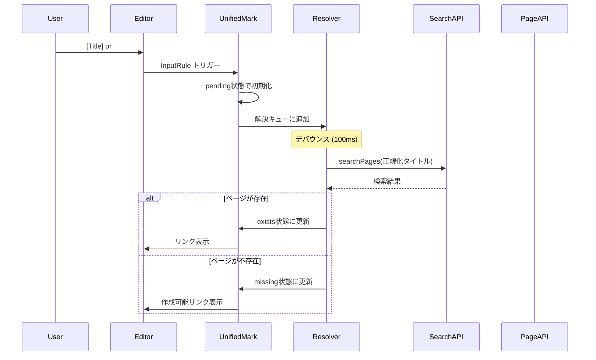
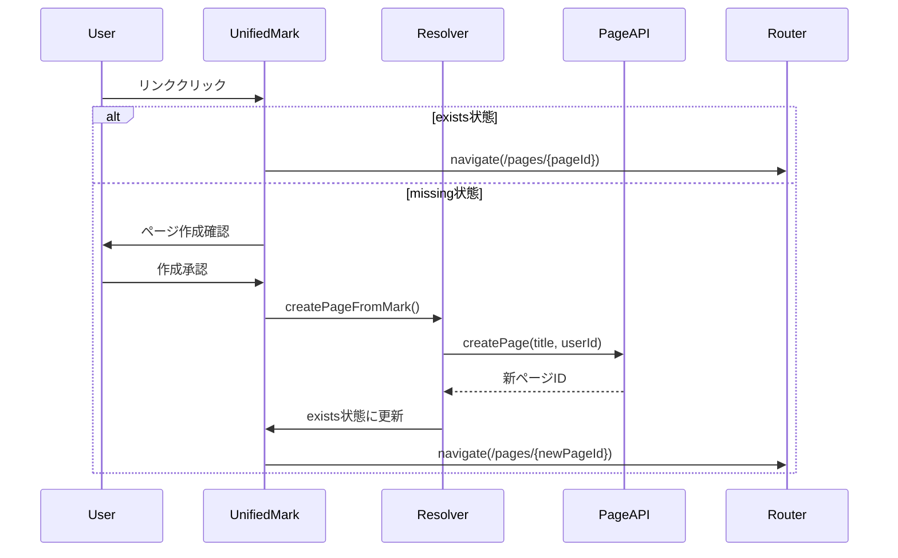
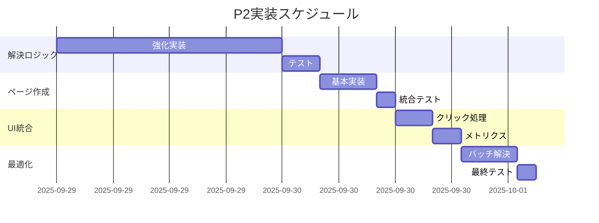

# UnifiedLinkMark P2 実装計画書: 解決ロジック統合

**作成日**: 2025 年 9 月 29 日  
**対象フェーズ**: P2 (Resolution Logic Integration)  
**前提条件**: P1 (Unified Mark Implementation) 完了  
**目標**: searchPages API 統合、存在確認、ページ作成、ナビゲーション機能の完全実装

## 1. 概要

P2 では、P1 で作成した UnifiedLinkMark の基盤に対して、実用的なリンク解決機能を統合します。既存の PageLinkMark で実装されている解決ロジックを参考にしながら、より統一的で効率的なシステムを構築します。

### 1.1 実装範囲

- 非同期ページ検索とキャッシュ統合
- 存在確認ロジックの強化
- missing 状態からの新規ページ作成フロー
- exists 状態でのナビゲーション処理
- エラーハンドリングと再試行機能
- メトリクス統合

### 1.2 参照資料

以下の既存実装を参考資料として活用します：

- `lib/utils/searchPages.ts` - 基本検索機能
- `lib/tiptap-extensions/page-link-mark.ts` - 既存解決ロジック
- `app/api/search-suggestions/route.ts` - 検索 API 実装
- `app/_actions/pages.ts` - ページ作成 Server Actions
- `lib/metrics/pageLinkMetrics.ts` - メトリクス機能

## 2. 技術仕様

### 2.1 強化対象コンポーネント

#### 2.1.1 UnifiedLinkMark 拡張 (`lib/tiptap-extensions/unified-link-mark.ts`)

現在の unified-link-mark.ts に以下の機能を追加：

```typescript
// 追加する主要機能
1. 強化された解決キュー管理
2. searchPages API統合
3. ページ作成APIコール
4. ナビゲーション処理
5. メトリクス統合
6. エラーハンドリング
```

#### 2.1.2 新規ユーティリティ (`lib/unilink/resolver.ts`)

解決ロジック専用のユーティリティ：

```typescript
// 主要クラス・関数
- PageResolver: 非同期ページ解決管理
- createPageFromMark: missing状態からのページ作成
- navigateToPage: exists状態でのナビゲーション
- batchResolve: 複数マークの一括解決
```

### 2.2 データフロー

#### 2.2.1 解決プロセス



#### 2.2.2 クリック処理フロー



## 3. 実装タスク

### 3.1 タスク一覧

#### Task P2.1: 解決ロジック強化

**ファイル**: `lib/tiptap-extensions/unified-link-mark.ts`  
**優先度**: 高  
**工数**: 3-4 時間

**実装内容**:

1. 既存の updateMarkState 関数を強化
2. searchPages API との統合
3. TTL キャッシュとの連携
4. エラーハンドリングとリトライ機能

**参考実装**:

```typescript
// page-link-mark.tsのrefreshPageLinkMarks関数 (200-280行)
// 特に非同期解決とエラーハンドリング部分
```

#### Task P2.2: 新規ページ作成機能

**ファイル**: `lib/unilink/resolver.ts` (新規作成)  
**優先度**: 高  
**工数**: 2-3 時間

**実装内容**:

1. createPageFromMark 関数実装
2. Server Actions との統合
3. 作成後のマーク状態更新
4. ナビゲーション処理

**参考実装**:

```typescript
// page-link.tsの557行付近のページ作成ロジック
// app/_actions/pages.tsのcreatePageアクション
```

#### Task P2.3: クリック処理統合

**ファイル**: `lib/tiptap-extensions/unified-link-mark.ts`  
**優先度**: 中  
**工数**: 2 時間

**実装内容**:

1. renderHTML 内のクリックハンドラー追加
2. exists/missing 状態別処理
3. ページ作成ダイアログ統合

#### Task P2.4: メトリクス統合

**ファイル**: `lib/unilink/metrics.ts` (新規作成)  
**優先度**: 中  
**工数**: 1-2 時間

**実装内容**:

1. 既存メトリクス関数の統合
2. UnifiedLinkMark 専用メトリクス
3. パフォーマンス測定

**参考実装**:

```typescript
// lib/metrics/pageLinkMetrics.ts
// markPending, markResolved, markMissing関数
```

#### Task P2.5: バッチ解決機能

**ファイル**: `lib/unilink/resolver.ts`  
**優先度**: 低  
**工数**: 2-3 時間

**実装内容**:

1. 複数マークの一括解決
2. API 呼び出し最適化
3. プログレス表示

### 3.2 実装順序



## 4. 詳細実装仕様

### 4.1 強化された updateMarkState 関数

```typescript
// lib/tiptap-extensions/unified-link-mark.ts内
async function updateMarkState(
  editor: Editor,
  markId: string,
  updates: Partial<UnifiedLinkAttributes>
): Promise<void> {
  // 1. キャッシュチェック
  const cached = ttlCache.get(updates.key || "");
  if (cached) {
    applyMarkUpdates(editor, markId, cached);
    return;
  }

  // 2. 解決キューへの追加（デバウンス）
  const existing = resolverQueue.get(markId);
  if (existing) {
    await existing; // 既存処理の完了を待つ
  }

  // 3. 新規解決プロセス
  const resolvePromise = resolveMarkState(editor, markId, updates);
  resolverQueue.set(markId, resolvePromise);

  try {
    await resolvePromise;
  } finally {
    resolverQueue.delete(markId);
  }
}

async function resolveMarkState(
  editor: Editor,
  markId: string,
  updates: Partial<UnifiedLinkAttributes>
): Promise<void> {
  try {
    // メトリクス: pending開始
    markPending(markId, updates.text || "");

    // searchPages API呼び出し
    const results = await searchPages(updates.key || "");
    const exactMatch = results.find(
      (r) => normalizeTitleToKey(r.title) === updates.key
    );

    if (exactMatch) {
      // exists状態への更新
      const resolved = {
        ...updates,
        state: "exists" as const,
        exists: true,
        pageId: exactMatch.id,
        href: `/pages/${exactMatch.id}`,
      };

      applyMarkUpdates(editor, markId, resolved);
      ttlCache.set(updates.key!, resolved);
      markResolved(markId);
    } else {
      // missing状態への更新
      const missing = {
        ...updates,
        state: "missing" as const,
        exists: false,
        href: "#",
      };

      applyMarkUpdates(editor, markId, missing);
      markMissing(markId);
    }
  } catch (error) {
    console.error("Resolution failed:", error);
    // エラー状態への更新
    applyMarkUpdates(editor, markId, {
      ...updates,
      state: "error" as const,
    });
  }
}
```

### 4.2 ページ作成機能

```typescript
// lib/unilink/resolver.ts
import { createPage } from "@/app/_actions/pages";
import { useRouter } from "next/navigation";

export async function createPageFromMark(
  editor: Editor,
  markId: string,
  title: string
): Promise<string | null> {
  try {
    // Server Actionでページ作成
    const pageId = await createPage({
      title,
      content_tiptap: {
        type: "doc",
        content: [
          {
            type: "paragraph",
            content: [
              {
                type: "text",
                text: `# ${title}\n\n新しいページです。`,
              },
            ],
          },
        ],
      },
    });

    if (pageId) {
      // マークをexists状態に更新
      await updateMarkState(editor, markId, {
        state: "exists",
        exists: true,
        pageId,
        href: `/pages/${pageId}`,
      });

      return pageId;
    }
    return null;
  } catch (error) {
    console.error("Page creation failed:", error);
    toast.error("ページの作成に失敗しました");
    return null;
  }
}

export function navigateToPage(pageId: string): void {
  const router = useRouter();
  router.push(`/pages/${pageId}`);
}
```

### 4.3 クリック処理の統合

```typescript
// renderHTML内のクリックハンドラー
renderHTML({ HTMLAttributes, editor }) {
  return [
    'a',
    mergeAttributes(this.options.HTMLAttributes, {
      ...HTMLAttributes,
      onClick: (event: MouseEvent) => {
        event.preventDefault();

        const target = event.currentTarget as HTMLElement;
        const markId = target.getAttribute('data-mark-id');
        const state = target.getAttribute('data-state');
        const pageId = target.getAttribute('data-page-id');
        const title = target.getAttribute('data-text');

        if (state === 'exists' && pageId) {
          navigateToPage(pageId);
        } else if (state === 'missing' && title && markId) {
          handleMissingLinkClick(editor, markId, title);
        }
      }
    }),
    0
  ];
},

async function handleMissingLinkClick(
  editor: Editor,
  markId: string,
  title: string
): Promise<void> {
  const confirmed = confirm(
    `「${title}」というページは存在しません。新しく作成しますか？`
  );

  if (confirmed) {
    const pageId = await createPageFromMark(editor, markId, title);
    if (pageId) {
      navigateToPage(pageId);
    }
  }
}
```

## 5. テスト計画

### 5.1 単体テスト

- updateMarkState 関数のテスト
- createPageFromMark 関数のテスト
- キャッシュ機能のテスト
- エラーハンドリングのテスト

### 5.2 統合テスト

- エディタでの[Title]入力 → 解決フロー
- エディタでの#tag 入力 → 解決フロー
- ページ作成 → ナビゲーションフロー
- クロスタブ同期テスト

### 5.3 パフォーマンステスト

- 大量マーク解決時の負荷測定
- キャッシュ効率の検証
- API 呼び出し回数の最適化検証

## 6. 運用考慮事項

### 6.1 ロールアウト戦略

1. 既存 PageLinkMark との並行運用
2. 段階的な機能有効化
3. ユーザーフィードバックの収集

### 6.2 監視・メトリクス

- 解決成功率の監視
- レスポンス時間の測定
- エラー率の追跡
- キャッシュヒット率の監視

### 6.3 フォールバック機能

- API 障害時の処理
- ネットワーク断線時の挙動
- 権限エラー時の対応

## 7. P3 への準備

P2 完了後、以下の項目が P3（リアルタイム自動再解決）への基盤となります：

1. **安定した解決ロジック**: P2 で確立される解決メカニズム
2. **キャッシュ基盤**: TTL キャッシュと BroadcastChannel 統合
3. **メトリクス基盤**: パフォーマンス監視とエラー追跡
4. **エラーハンドリング**: 堅牢な例外処理機能

## 8. 完了条件

P2 の完了条件：

- ✅ UnifiedLinkMark でのページ検索・解決が正常動作
- ✅ missing 状態からの新規ページ作成が可能
- ✅ exists 状態でのページナビゲーションが正常動作
- ✅ エラーハンドリングが適切に機能
- ✅ メトリクス統合が完了
- ✅ TypeScript コンパイルエラーなし
- ✅ 基本的な統合テストが通過

---

**次回更新**: P2 実装完了時  
**担当者**: GitHub Copilot  
**レビュー**: P2 実装前に技術仕様を再確認
