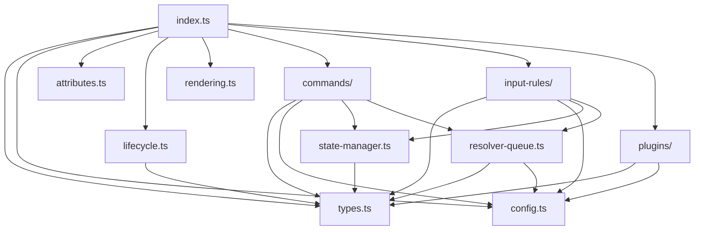

# UnifiedLinkMark リファクタリング実装計画書

## 📋 ドキュメント情報

- **作成日**: 2025 年 10 月 11 日
- **対象ブランチ**: `feature/unified-link-migration-and-tdd`
- **担当**: AI 開発アシスタント
- **目的**: UnifiedLinkMark の単一ファイル実装を複数ファイルに分割し、保守性・テスト容易性を向上させる

## 🎯 目的と背景

### 目的

1. **可読性の向上**: 628 行の単一ファイルを機能別に分割
2. **保守性の向上**: 責務を明確に分離し、変更の影響範囲を限定
3. **テスト容易性の向上**: 各機能を独立してテスト可能に
4. **再利用性の向上**: 他の拡張機能での部品再利用を促進

### 背景

現在の `lib/tiptap-extensions/unified-link-mark.ts` は以下の課題を抱えています：

- 単一ファイルに 628 行のコード
- 複数の責務が混在（解決処理、状態管理、InputRule、Plugin、Commands）
- グローバル変数の使用（`resolverQueue`, `isResolverRunning`, `globalAutoReconciler`）
- テストやメンテナンスが困難
- 新機能追加時の影響範囲が不明確

## 📐 アーキテクチャ設計

### 分割後のディレクトリ構造

```
lib/tiptap-extensions/unified-link-mark/
├── index.ts                          # エントリーポイント・Mark定義
├── types.ts                          # 型定義
├── config.ts                         # デフォルト設定・定数
├── attributes.ts                     # Mark属性定義
├── lifecycle.ts                      # ライフサイクルフック
├── rendering.ts                      # HTML レンダリング
├── resolver-queue.ts                 # 解決キュー処理
├── state-manager.ts                  # Mark状態更新処理
├── commands/
│   ├── index.ts                      # Commandsエクスポート
│   ├── insert-unified-link.ts        # insertUnifiedLink コマンド
│   └── refresh-unified-links.ts      # refreshUnifiedLinks コマンド
├── input-rules/
│   ├── index.ts                      # InputRulesエクスポート
│   ├── bracket-rule.ts               # [Title] InputRule
│   ├── tag-rule.ts                   # #タグ InputRule
│   └── utils.ts                      # 共通ユーティリティ
└── plugins/
    ├── index.ts                      # Pluginsエクスポート
    ├── auto-bracket-plugin.ts        # 自動ブラケット閉じ
    └── click-handler-plugin.ts       # クリックハンドラー
```

### 依存関係図



## 🗂️ 各ファイルの詳細仕様

### 1. types.ts (~50 行)

**責務**: 全ての型定義を集約

```typescript
/**
 * UnifiedLinkMark の型定義
 */

import type { Editor } from "@tiptap/core";

// Mark オプション
export interface UnifiedLinkMarkOptions {
  HTMLAttributes: Record<string, string>;
  autoReconciler?: AutoReconciler | null;
  noteSlug?: string | null;
  userId?: string | null;
  onShowCreatePageDialog?: (
    title: string,
    onConfirm: () => Promise<void>
  ) => void;
}

// Mark 属性
export interface UnifiedLinkAttributes {
  variant: "bracket" | "tag";
  raw: string;
  text: string;
  key: string;
  pageId?: string | null;
  href: string;
  state: "pending" | "exists" | "missing" | "error";
  exists: boolean;
  created?: boolean;
  meta?: object;
  markId: string;
}

// 検索結果
export interface SearchResult {
  id: string;
  title: string;
  similarity?: number;
}

// 解決キューアイテム
export interface ResolverQueueItem {
  key: string;
  markId: string;
  editor: Editor;
  variant?: "bracket" | "tag";
}
```

**依存関係**: なし（他のモジュールに依存されるのみ）

---

### 2. config.ts (~40 行)

**責務**: 定数とデフォルト設定を管理

```typescript
/**
 * UnifiedLinkMark の設定定数
 */

import type { UnifiedLinkMarkOptions } from "./types";

// HTML属性のデフォルト値
export const DEFAULT_HTML_ATTRIBUTES = {
  class: "unilink underline cursor-pointer",
};

// Mark オプションのデフォルト値
export const DEFAULT_OPTIONS: UnifiedLinkMarkOptions = {
  HTMLAttributes: DEFAULT_HTML_ATTRIBUTES,
  autoReconciler: null,
  noteSlug: null,
  userId: null,
  onShowCreatePageDialog: undefined,
};

// 解決処理の設定
export const RESOLVER_CONFIG = {
  batchSize: 10,
  batchDelay: 50,
  maxRetries: 2,
  retryDelayBase: 100, // 指数バックオフの基準値
} as const;

// 正規表現パターン
export const PATTERNS = {
  bracket: /\[([^\[\]]+)\]$/,
  tag: /\B#([a-zA-Z0-9\u3040-\u309F\u30A0-\u30FF\u4E00-\u9FAF\u3400-\u4DBF]{1,50})$/,
  externalUrl: /^https?:\/\//,
} as const;
```

**依存関係**: types.ts

---

### 3. attributes.ts (~120 行)

**責務**: Mark 属性の定義とパース/レンダリングロジック

```typescript
/**
 * UnifiedLinkMark の属性定義
 */

import type { UnifiedLinkAttributes } from "./types";

export const unifiedLinkAttributes = {
  variant: {
    default: "bracket",
    parseHTML: (element: HTMLElement) =>
      element.getAttribute("data-variant") || "bracket",
    renderHTML: (attributes: UnifiedLinkAttributes) => ({
      "data-variant": attributes.variant,
    }),
  },
  raw: {
    default: "",
    parseHTML: (element: HTMLElement) => element.getAttribute("data-raw") || "",
    renderHTML: (attributes: UnifiedLinkAttributes) => ({
      "data-raw": attributes.raw,
    }),
  },
  // ... 他の属性も同様に定義
};
```

**依存関係**: types.ts

---

### 4. lifecycle.ts (~60 行)

**責務**: エディタのライフサイクルフック処理

```typescript
/**
 * UnifiedLinkMark のライフサイクル処理
 */

import type { Editor } from "@tiptap/core";
import { AutoReconciler } from "../../unilink";

let globalAutoReconciler: AutoReconciler | null = null;

/**
 * エディタ作成時の初期化処理
 */
export function onCreateHandler(editor: Editor): void {
  if (editor && !globalAutoReconciler) {
    console.log("[UnifiedLinkMark] Initializing AutoReconciler...");
    globalAutoReconciler = new AutoReconciler(editor);
    globalAutoReconciler.initialize();
  }
}

/**
 * エディタ破棄時のクリーンアップ処理
 */
export function onDestroyHandler(): void {
  if (globalAutoReconciler) {
    console.log("[UnifiedLinkMark] Destroying AutoReconciler...");
    globalAutoReconciler.destroy();
    globalAutoReconciler = null;
  }
}

/**
 * AutoReconcilerのインスタンスを取得
 */
export function getAutoReconciler(): AutoReconciler | null {
  return globalAutoReconciler;
}
```

**依存関係**: AutoReconciler (unilink)

---

### 5. rendering.ts (~40 行)

**責務**: HTML レンダリングとパース処理

```typescript
/**
 * UnifiedLinkMark のレンダリング処理
 */

import { mergeAttributes } from "@tiptap/core";
import type { UnifiedLinkAttributes, UnifiedLinkMarkOptions } from "./types";

/**
 * Mark を HTML としてレンダリング
 */
export function renderHTML(
  HTMLAttributes: Record<string, any>,
  options: UnifiedLinkMarkOptions
) {
  const { variant, ...rest } = HTMLAttributes;
  const variantClass = `unilink--${variant}`;

  return [
    "a",
    mergeAttributes(options.HTMLAttributes, rest, {
      class: `${options.HTMLAttributes.class} ${variantClass}`,
    }),
    0,
  ];
}

/**
 * HTML から Mark をパース
 */
export function parseHTML() {
  return [
    {
      tag: "a[data-variant]",
    },
  ];
}
```

**依存関係**: types.ts, @tiptap/core

---

### 6. resolver-queue.ts (~180 行)

**責務**: ページ解決処理のキュー管理とバッチ実行

```typescript
/**
 * UnifiedLinkMark の解決キュー処理
 */

import type { ResolverQueueItem, SearchResult } from "./types";
import { searchPages } from "../../utils/searchPages";
import {
  normalizeTitleToKey,
  getCachedPageId,
  setCachedPageId,
} from "../../unilink";
import { RESOLVER_CONFIG } from "./config";
import { updateMarkState } from "./state-manager";
import {
  markPending,
  markResolved,
  markMissing,
} from "../../metrics/pageLinkMetrics";
import {
  markUnifiedPending,
  markUnifiedResolved,
  markUnifiedMissing,
  markUnifiedError,
  markUnifiedCacheHit,
} from "../../unilink/metrics";

/**
 * 解決キューのシングルトンクラス
 */
class ResolverQueue {
  private queue: ResolverQueueItem[] = [];
  private isRunning: boolean = false;

  /**
   * キューにアイテムを追加
   */
  add(item: ResolverQueueItem): void {
    this.queue.push(item);
  }

  /**
   * キューを処理
   */
  async process(): Promise<void> {
    if (this.isRunning) return;
    this.isRunning = true;

    while (this.queue.length > 0) {
      const batch = this.queue.splice(0, RESOLVER_CONFIG.batchSize);

      for (const item of batch) {
        await this.processItem(item);
      }

      await this.delay(RESOLVER_CONFIG.batchDelay);
    }

    this.isRunning = false;
  }

  /**
   * 個別アイテムを処理
   */
  private async processItem(item: ResolverQueueItem): Promise<void> {
    const { key, markId, editor, variant = "bracket" } = item;

    try {
      // メトリクス: pending開始
      markPending(markId, key);
      markUnifiedPending(markId, key, variant);

      // キャッシュチェック
      const cachedPageId = getCachedPageId(key);
      if (cachedPageId) {
        updateMarkState(editor, markId, {
          state: "exists",
          exists: true,
          pageId: cachedPageId,
          href: `/pages/${cachedPageId}`,
        });
        markResolved(markId);
        markUnifiedResolved(markId);
        markUnifiedCacheHit(markId, key);
        return;
      }

      // 検索実行（リトライ機能付き）
      const results = await searchPagesWithRetry(key);
      const exact = results.find((r) => normalizeTitleToKey(r.title) === key);

      if (exact) {
        setCachedPageId(key, exact.id);
        updateMarkState(editor, markId, {
          state: "exists",
          exists: true,
          pageId: exact.id,
          href: `/pages/${exact.id}`,
        });
        markResolved(markId);
        markUnifiedResolved(markId);
      } else {
        updateMarkState(editor, markId, {
          state: "missing",
          exists: false,
          href: "#",
        });
        markMissing(markId);
        markUnifiedMissing(markId);
      }
    } catch (error) {
      console.warn(`Failed to resolve key "${key}":`, error);
      updateMarkState(editor, markId, {
        state: "error",
      });
      markUnifiedError(markId, String(error));
    }
  }

  /**
   * 遅延処理
   */
  private delay(ms: number): Promise<void> {
    return new Promise((resolve) => setTimeout(resolve, ms));
  }
}

// シングルトンインスタンス
const resolverQueue = new ResolverQueue();

/**
 * キューにアイテムを追加し、処理を開始
 */
export function enqueueResolve(item: ResolverQueueItem): void {
  resolverQueue.add(item);
  queueMicrotask(() => resolverQueue.process());
}

/**
 * リトライ機能付きページ検索
 */
export async function searchPagesWithRetry(
  key: string,
  maxRetries = RESOLVER_CONFIG.maxRetries
): Promise<SearchResult[]> {
  let lastError: Error | null = null;

  for (let i = 0; i <= maxRetries; i++) {
    try {
      return await searchPages(key);
    } catch (error) {
      lastError = error as Error;
      if (i < maxRetries) {
        const delay = RESOLVER_CONFIG.retryDelayBase * 2 ** i;
        await new Promise((resolve) => setTimeout(resolve, delay));
      }
    }
  }

  throw lastError;
}
```

**依存関係**: types.ts, config.ts, state-manager.ts, 外部ユーティリティ

---

### 7. state-manager.ts (~100 行)

**責務**: Mark の状態更新と ID 生成

```typescript
/**
 * UnifiedLinkMark の状態管理
 */

import type { Editor } from "@tiptap/core";
import type { UnifiedLinkAttributes } from "./types";

/**
 * Mark の状態を更新
 */
export function updateMarkState(
  editor: Editor,
  markId: string,
  updates: Partial<UnifiedLinkAttributes>
): void {
  try {
    const { state, dispatch } = editor.view;
    if (!state || !dispatch) {
      console.warn("Editor state or dispatch not available");
      return;
    }

    const { tr } = state;
    const markType = state.schema.marks.unilink;
    if (!markType) {
      console.warn("unilink mark type not found in schema");
      return;
    }

    let changed = false;

    state.doc.descendants((node, pos: number) => {
      if (!node.isText || !node.text) return;

      for (const mark of node.marks) {
        if (mark.type === markType && mark.attrs.markId === markId) {
          const newAttrs = { ...mark.attrs, ...updates };

          // exists フラグを state と同期
          if (updates.state) {
            newAttrs.exists = updates.state === "exists";
          }

          tr.removeMark(pos, pos + node.text.length, markType);
          tr.addMark(pos, pos + node.text.length, markType.create(newAttrs));
          changed = true;
        }
      }
    });

    if (changed) {
      dispatch(tr);
    }
  } catch (error) {
    console.error("Failed to update mark state:", error);
  }
}

/**
 * ユニークな Mark ID を生成
 */
export function generateMarkId(): string {
  return `unilink-${Date.now().toString(36)}-${Math.random()
    .toString(36)
    .slice(2, 8)}`;
}

/**
 * 指定された状態の Mark を検索
 */
export function findMarksByState(
  editor: Editor,
  state: UnifiedLinkAttributes["state"]
): Array<{ markId: string; key: string }> {
  const marks: Array<{ markId: string; key: string }> = [];
  const { doc } = editor.state;
  const markType = editor.schema.marks.unilink;

  if (!markType) return marks;

  doc.descendants((node) => {
    if (!node.isText) return;

    for (const mark of node.marks) {
      if (mark.type === markType && mark.attrs.state === state) {
        marks.push({
          markId: mark.attrs.markId,
          key: mark.attrs.key,
        });
      }
    }
  });

  return marks;
}
```

**依存関係**: types.ts

---

### 8. commands/index.ts (~20 行)

**責務**: Commands のエクスポート集約

```typescript
/**
 * UnifiedLinkMark のコマンド
 */

import type { Editor } from "@tiptap/core";
import { createInsertUnifiedLinkCommand } from "./insert-unified-link";
import { createRefreshUnifiedLinksCommand } from "./refresh-unified-links";

export function createCommands(context: { editor: Editor; type: any }) {
  return {
    insertUnifiedLink: createInsertUnifiedLinkCommand(context),
    refreshUnifiedLinks: createRefreshUnifiedLinksCommand(context),
  };
}
```

**依存関係**: 各コマンドファイル

---

### 9. commands/insert-unified-link.ts (~60 行)

**責務**: insertUnifiedLink コマンドの実装

```typescript
/**
 * insertUnifiedLink コマンド
 */

import type { CommandProps } from "@tiptap/core";
import type { UnifiedLinkAttributes } from "../types";
import { normalizeTitleToKey } from "../../../unilink";
import { generateMarkId } from "../state-manager";
import { enqueueResolve } from "../resolver-queue";

export function createInsertUnifiedLinkCommand(context: {
  editor: any;
  type: any;
}) {
  return (attrs: Partial<UnifiedLinkAttributes>) =>
    ({ state, dispatch }: CommandProps) => {
      const { selection } = state;
      const { from, to } = selection;

      const markId = generateMarkId();
      const key = normalizeTitleToKey(attrs.raw || "");

      const fullAttrs: UnifiedLinkAttributes = {
        variant: attrs.variant || "bracket",
        raw: attrs.raw || "",
        text: attrs.text || attrs.raw || "",
        key,
        pageId: null,
        href: "#",
        state: "pending",
        exists: false,
        markId,
        ...attrs,
      };

      if (dispatch) {
        const tr = state.tr.addMark(from, to, context.type.create(fullAttrs));
        dispatch(tr);

        // 解決キューに追加
        enqueueResolve({
          key,
          markId,
          editor: context.editor,
          variant: fullAttrs.variant,
        });
      }

      return true;
    };
}
```

**依存関係**: types.ts, state-manager.ts, resolver-queue.ts

---

### 10. commands/refresh-unified-links.ts (~50 行)

**責務**: refreshUnifiedLinks コマンドの実装

```typescript
/**
 * refreshUnifiedLinks コマンド
 */

import type { CommandProps } from "@tiptap/core";
import { findMarksByState } from "../state-manager";
import { enqueueResolve } from "../resolver-queue";

export function createRefreshUnifiedLinksCommand(context: {
  editor: any;
  type: any;
}) {
  return () =>
    ({ state, dispatch }: CommandProps) => {
      const markType = context.type;
      const toRefresh: Array<{ key: string; markId: string }> = [];

      state.doc.descendants((node) => {
        if (!node.isText) return;

        for (const mark of node.marks) {
          if (mark.type === markType && mark.attrs.state !== "exists") {
            toRefresh.push({
              key: mark.attrs.key,
              markId: mark.attrs.markId,
            });
          }
        }
      });

      // キューに追加
      for (const { key, markId } of toRefresh) {
        enqueueResolve({
          key,
          markId,
          editor: context.editor,
        });
      }

      return true;
    };
}
```

**依存関係**: state-manager.ts, resolver-queue.ts

---

### 11. input-rules/index.ts (~20 行)

**責務**: InputRules のエクスポート集約

```typescript
/**
 * UnifiedLinkMark の InputRules
 */

import { createBracketInputRule } from "./bracket-rule";
import { createTagInputRule } from "./tag-rule";

export function createInputRules(context: { editor: any; name: string }) {
  return [createTagInputRule(context), createBracketInputRule(context)];
}
```

**依存関係**: 各 InputRule ファイル

---

### 12. input-rules/bracket-rule.ts (~80 行)

**責務**: [Title] 形式の InputRule

```typescript
/**
 * ブラケット記法の InputRule
 */

import { InputRule } from "@tiptap/core";
import type { UnifiedLinkAttributes } from "../types";
import { PATTERNS } from "../config";
import { normalizeTitleToKey } from "../../../unilink";
import { generateMarkId } from "../state-manager";
import { enqueueResolve } from "../resolver-queue";
import { isInCodeContext } from "./utils";

export function createBracketInputRule(context: { editor: any; name: string }) {
  return new InputRule({
    find: PATTERNS.bracket,
    handler: ({ state, match, range, chain }) => {
      // コードコンテキスト抑制
      if (isInCodeContext(state)) {
        return null;
      }

      const raw = match[1];
      const text = raw;
      const key = normalizeTitleToKey(raw);
      const markId = generateMarkId();

      // 外部リンクチェック
      const isExternal = PATTERNS.externalUrl.test(raw);

      const { from, to } = range;

      const attrs: UnifiedLinkAttributes = {
        variant: "bracket",
        raw,
        text,
        key,
        pageId: null,
        href: isExternal ? raw : "#",
        state: isExternal ? "exists" : "pending",
        exists: isExternal,
        markId,
      };

      // マークを適用
      chain()
        .focus()
        .deleteRange({ from, to })
        .insertContent({
          type: "text",
          text: text,
          marks: [{ type: context.name, attrs }],
        })
        .run();

      // 外部リンクでなければ解決キューに追加
      if (!isExternal) {
        enqueueResolve({
          key,
          markId,
          editor: context.editor,
          variant: "bracket",
        });
      }
    },
  });
}
```

**依存関係**: types.ts, config.ts, state-manager.ts, resolver-queue.ts, utils.ts

---

### 13. input-rules/tag-rule.ts (~70 行)

**責務**: #タグ 形式の InputRule

```typescript
/**
 * タグ記法の InputRule
 */

import { InputRule } from "@tiptap/core";
import type { UnifiedLinkAttributes } from "../types";
import { PATTERNS } from "../config";
import { normalizeTitleToKey } from "../../../unilink";
import { generateMarkId } from "../state-manager";
import { enqueueResolve } from "../resolver-queue";
import { isInCodeContext } from "./utils";

export function createTagInputRule(context: { editor: any; name: string }) {
  return new InputRule({
    find: PATTERNS.tag,
    handler: ({ state, match, range, chain }) => {
      // コードコンテキスト抑制
      if (isInCodeContext(state)) {
        return null;
      }

      const raw = match[1];
      const text = raw;
      const key = normalizeTitleToKey(raw);
      const markId = generateMarkId();

      const attrs: UnifiedLinkAttributes = {
        variant: "tag",
        raw,
        text,
        key,
        pageId: null,
        href: "#",
        state: "pending",
        exists: false,
        markId,
      };

      const { from, to } = range;

      // マークを適用
      chain()
        .focus()
        .deleteRange({ from, to })
        .insertContent({
          type: "text",
          text: text,
          marks: [{ type: context.name, attrs }],
        })
        .run();

      // 解決キューに追加
      enqueueResolve({
        key,
        markId,
        editor: context.editor,
        variant: "tag",
      });
    },
  });
}
```

**依存関係**: types.ts, config.ts, state-manager.ts, resolver-queue.ts, utils.ts

---

### 14. input-rules/utils.ts (~30 行)

**責務**: InputRules 共通ユーティリティ

```typescript
/**
 * InputRules 共通ユーティリティ
 */

import type { EditorState } from "prosemirror-state";

/**
 * コードコンテキスト内かどうかを判定
 */
export function isInCodeContext(state: EditorState): boolean {
  const $from = state.selection.$from;

  // コードブロック内かチェック
  if ($from.parent.type.name === "codeBlock") {
    return true;
  }

  // インラインコード内かチェック
  if ($from.marks().some((m) => m.type.name === "code")) {
    return true;
  }

  return false;
}
```

**依存関係**: prosemirror-state

---

### 15. plugins/index.ts (~20 行)

**責務**: Plugins のエクスポート集約

```typescript
/**
 * UnifiedLinkMark の ProseMirror Plugins
 */

import { createAutoBracketPlugin } from "./auto-bracket-plugin";
import { createClickHandlerPlugin } from "./click-handler-plugin";

export function createPlugins(context: { editor: any; options: any }) {
  return [createAutoBracketPlugin(), createClickHandlerPlugin(context)];
}
```

**依存関係**: 各 Plugin ファイル

---

### 16. plugins/auto-bracket-plugin.ts (~50 行)

**責務**: 自動ブラケット閉じ機能

```typescript
/**
 * 自動ブラケット閉じ Plugin
 */

import { Plugin, PluginKey, TextSelection } from "prosemirror-state";

export function createAutoBracketPlugin() {
  return new Plugin({
    key: new PluginKey("unifiedLinkAutoBracket"),
    props: {
      handleTextInput(view, from, to, text) {
        if (text !== "[") {
          return false;
        }

        const { state, dispatch } = view;
        const $pos = state.doc.resolve(from);

        // Auto-close only at end of paragraph without trailing text
        if ($pos.parent.type.name === "paragraph") {
          const paraEnd = $pos.end($pos.depth);
          const after = state.doc.textBetween(to, paraEnd);

          if (/^\s*$/.test(after)) {
            // No trailing text, auto-close
            const tr = state.tr.insertText("[]", from, to);
            // Set cursor inside brackets
            tr.setSelection(TextSelection.create(tr.doc, from + 1));
            dispatch(tr);
            return true;
          }
        }

        return false;
      },
    },
  });
}
```

**依存関係**: prosemirror-state

---

### 17. plugins/click-handler-plugin.ts (~80 行)

**責務**: リンククリックハンドラー

```typescript
/**
 * クリックハンドラー Plugin
 */

import { Plugin, PluginKey } from "prosemirror-state";
import type { UnifiedLinkAttributes } from "../types";
import {
  navigateToPage,
  handleMissingLinkClick,
} from "../../../unilink/resolver";

export function createClickHandlerPlugin(context: {
  editor: any;
  options: any;
}) {
  return new Plugin({
    key: new PluginKey("unifiedLinkClickHandler"),
    props: {
      handleClick: (view, pos, event) => {
        const { state } = view;
        const { doc } = state;
        const $pos = doc.resolve(pos);

        // クリックされた位置にunilinkマークがあるかチェック
        const unilinkMark = $pos
          .marks()
          .find((mark) => mark.type.name === "unilink");

        if (!unilinkMark) {
          return false;
        }

        event.preventDefault();
        const attrs = unilinkMark.attrs as UnifiedLinkAttributes;

        console.log(
          `[UnifiedLinkMark] Click: state=${attrs.state}, pageId=${attrs.pageId}, text=${attrs.text}`
        );

        if (attrs.state === "exists" && attrs.pageId) {
          // 既存ページへのナビゲーション
          navigateToPage(attrs.pageId);
        } else if (attrs.state === "missing" && attrs.text && attrs.markId) {
          // missing状態からのページ作成フロー
          handleMissingLinkClick(
            context.editor,
            attrs.markId,
            attrs.text,
            context.options.userId || undefined,
            context.options.onShowCreatePageDialog
          );
        } else if (attrs.state === "pending") {
          // pending状態では何もしない
          console.log("[UnifiedLinkMark] Link is still resolving...");
        } else {
          console.warn(
            "[UnifiedLinkMark] Unknown state or missing data:",
            attrs
          );
        }

        return true;
      },
    },
  });
}
```

**依存関係**: types.ts, unilink/resolver

---

### 18. index.ts (~80 行)

**責務**: すべてを統合して Mark.create() を実行

```typescript
/**
 * UnifiedLinkMark - 統合リンクマーク
 * [Title] と #タグ の両方を単一のマークで処理
 */

import { Mark } from "@tiptap/core";
import type { UnifiedLinkMarkOptions } from "./types";
import { DEFAULT_OPTIONS } from "./config";
import { unifiedLinkAttributes } from "./attributes";
import { onCreateHandler, onDestroyHandler } from "./lifecycle";
import { renderHTML, parseHTML } from "./rendering";
import { createCommands } from "./commands";
import { createInputRules } from "./input-rules";
import { createPlugins } from "./plugins";

export * from "./types";
export * from "./config";
export * from "./state-manager";
export * from "./resolver-queue";

export const UnifiedLinkMark = Mark.create<UnifiedLinkMarkOptions>({
  name: "unilink",
  priority: 1000,
  inclusive: false,

  addOptions() {
    return DEFAULT_OPTIONS;
  },

  onCreate() {
    onCreateHandler(this.editor);
  },

  onDestroy() {
    onDestroyHandler();
  },

  addAttributes() {
    return unifiedLinkAttributes;
  },

  renderHTML({ HTMLAttributes }) {
    return renderHTML(HTMLAttributes, this.options);
  },

  parseHTML() {
    return parseHTML();
  },

  addCommands() {
    return createCommands({
      editor: this.editor,
      type: this.type,
    });
  },

  addInputRules() {
    return createInputRules({
      editor: this.editor,
      name: this.name,
    });
  },

  addProseMirrorPlugins() {
    return createPlugins({
      editor: this.editor,
      options: this.options,
    });
  },
});
```

**依存関係**: すべてのモジュール

---

## 🧪 テスト戦略

### テストファイルの構成

```
lib/tiptap-extensions/unified-link-mark/__tests__/
├── types.test.ts                     # 型のテスト（コンパイル時）
├── config.test.ts                    # 設定値のテスト
├── attributes.test.ts                # 属性定義のテスト
├── resolver-queue.test.ts            # 解決キュー処理のテスト
├── state-manager.test.ts             # 状態管理のテスト
├── commands/
│   ├── insert-unified-link.test.ts
│   └── refresh-unified-links.test.ts
├── input-rules/
│   ├── bracket-rule.test.ts
│   ├── tag-rule.test.ts
│   └── utils.test.ts
├── plugins/
│   ├── auto-bracket-plugin.test.ts
│   └── click-handler-plugin.test.ts
└── integration.test.ts               # 統合テスト（既存のテストを移行）
```

### テスト方針

1. **ユニットテスト**: 各モジュールを独立してテスト
2. **統合テスト**: Mark 全体の動作をテスト（既存のテストを活用）
3. **カバレッジ目標**: 80%以上

---

## 📅 実装スケジュール

### Phase 1: 準備と設計 ✅

- [x] 実装計画書の作成
- [ ] 既存テストの確認と分析
- [ ] ディレクトリ構造の作成

### Phase 2: 基盤モジュールの実装 (1-2 日)

**優先度**: 高

- [ ] types.ts の作成
- [ ] config.ts の作成
- [ ] state-manager.ts の作成
- [ ] 基盤モジュールのユニットテスト作成
- [ ] 既存テストが通ることを確認

### Phase 3: 解決処理の分離 (1-2 日)

**優先度**: 高

- [ ] resolver-queue.ts の作成
- [ ] resolver-queue のユニットテスト作成
- [ ] 既存テストが通ることを確認

### Phase 4: 属性とレンダリングの分離 (半日)

**優先度**: 中

- [ ] attributes.ts の作成
- [ ] rendering.ts の作成
- [ ] lifecycle.ts の作成
- [ ] 各モジュールのユニットテスト作成

### Phase 5: コマンドの分離 (1 日)

**優先度**: 中

- [ ] commands/ ディレクトリの実装
- [ ] コマンドのユニットテスト作成
- [ ] 既存テストが通ることを確認

### Phase 6: InputRules の分離 (1 日)

**優先度**: 中

- [ ] input-rules/ ディレクトリの実装
- [ ] InputRules のユニットテスト作成
- [ ] 既存テストが通ることを確認

### Phase 7: Plugins の分離 (1 日)

**優先度**: 中

- [ ] plugins/ ディレクトリの実装
- [ ] Plugins のユニットテスト作成
- [ ] 既存テストが通ることを確認

### Phase 8: 統合とクリーンアップ (1 日)

**優先度**: 高

- [ ] index.ts の作成
- [ ] 統合テストの実行
- [ ] 既存の unified-link-mark.ts の削除
- [ ] インポートパスの更新
- [ ] ドキュメントの更新

### Phase 9: 最終確認 (半日)

**優先度**: 高

- [ ] 全テストの実行
- [ ] コードレビュー
- [ ] リファクタリング完了報告書の作成
- [ ] PR 作成

**総所要時間**: 約 6-8 日

---

## ⚠️ リスクと対策

### リスク 1: 既存テストの破壊

**リスク**: リファクタリング中に既存テストが壊れる

**対策**:

- 各 Phase 完了後に既存テストを実行
- CI/CD パイプラインでの自動テスト
- 段階的な移行（一度にすべて変更しない）

### リスク 2: インポートパスの変更による影響

**リスク**: 他のファイルからのインポートが壊れる

**対策**:

- index.ts で後方互換性のあるエクスポートを維持
- grep 検索で全インポート箇所を確認
- TypeScript のコンパイルエラーで検出

### リスク 3: グローバル状態の管理

**リスク**: resolverQueue や globalAutoReconciler の管理が複雑化

**対策**:

- シングルトンパターンで明確に管理
- エクスポートを制限してカプセル化
- ライフサイクル管理を lifecycle.ts に集約

### リスク 4: パフォーマンスの劣化

**リスク**: モジュール分割によるオーバーヘッド

**対策**:

- ビルド後のバンドルサイズを確認
- パフォーマンステストの実施
- 必要に応じてコード最適化

---

## ✅ 完了条件

1. **機能的完全性**

   - [ ] すべての既存機能が動作する
   - [ ] 既存テストがすべて通過する
   - [ ] 新しいユニットテストがすべて通過する

2. **コード品質**

   - [ ] TypeScript のコンパイルエラーがない
   - [ ] ESLint の警告がない
   - [ ] テストカバレッジ 80%以上

3. **ドキュメント**

   - [ ] 各モジュールにコメント記述
   - [ ] README の更新（必要に応じて）
   - [ ] リファクタリング完了報告書の作成

4. **レビュー**
   - [ ] コードレビューの完了
   - [ ] チームメンバーの承認

---

## 📚 参考資料

- [TipTap Extension API](https://tiptap.dev/api/extensions)
- [ProseMirror Plugin Guide](https://prosemirror.net/docs/guide/)
- [既存実装](lib/tiptap-extensions/unified-link-mark.ts)
- [既存テスト](lib/tiptap-extensions/__tests__/unified-link-mark.test.ts)
- [調査レポート](docs/07_research/2025_10/20251010/link-implementation-investigation.md)

---

## 📝 変更履歴

| 日付       | 変更内容 | 担当者              |
| ---------- | -------- | ------------------- |
| 2025-10-11 | 初版作成 | AI 開発アシスタント |

---

## 🔗 関連ドキュメント

- [UnifiedLinkMark 仕様書](../../03_design/specifications/unified-link-mark-spec.md)
- [リンク機能実装調査](../../07_research/2025_10/20251010/link-implementation-investigation.md)
- [Legacy 削除計画](../../04_implementation/plans/page-link-legacy-removal-plan.md)
