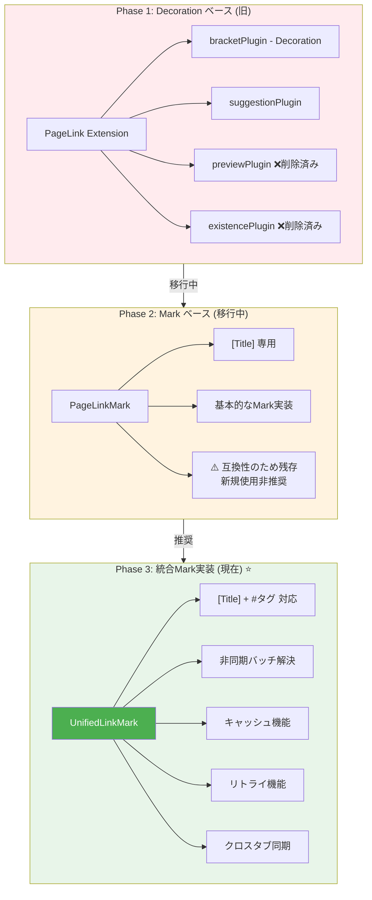
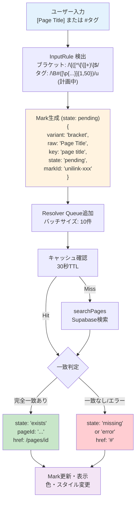
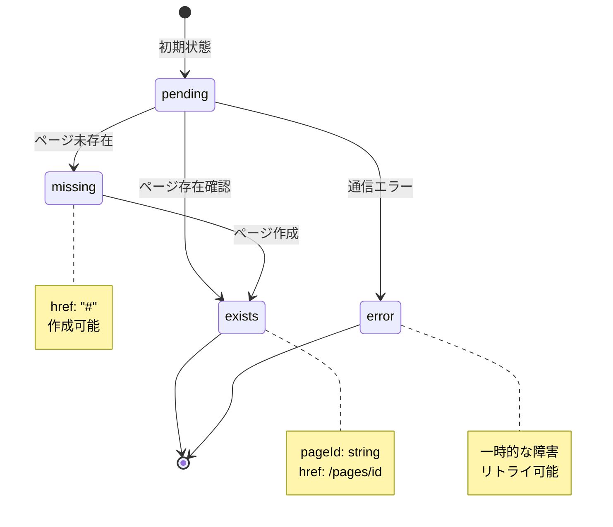
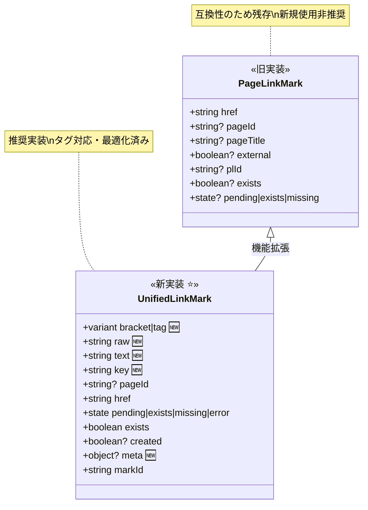
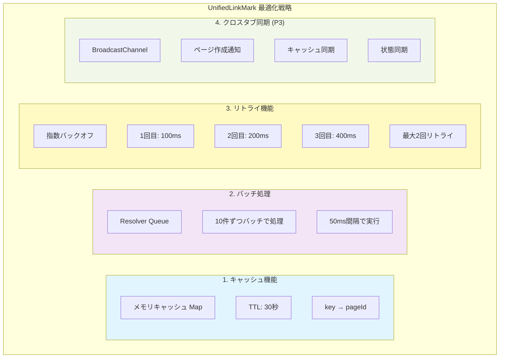
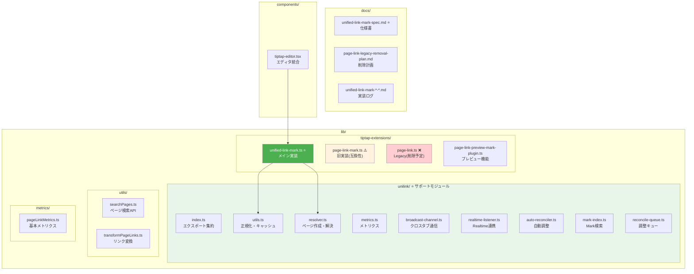

# リンク機能実装調査 - 概要図

## リンク実装の 3 世代



## UnifiedLinkMark アーキテクチャ



## 状態遷移図



## データ構造の比較



## パフォーマンス最適化機能



## ファイル構造



## 推奨される使用方法

```typescript
// ✅ 推奨: UnifiedLinkMark を使用
import { UnifiedLinkMark } from "@/lib/tiptap-extensions/unified-link-mark";

const editor = useEditor({
  extensions: [
    UnifiedLinkMark, // これを使う
    // ...
  ],
});

// ⚠️ 非推奨: PageLinkMark（互換性のため残存）
import { PageLinkMark } from "@/lib/tiptap-extensions/page-link-mark";
// 既存コードでのみ使用可能、新規では使用しない

// ❌ 使用禁止: PageLink（削除予定）
import { PageLink } from "@/lib/tiptap-extensions/page-link";
// Legacy実装、使用しないこと
```
